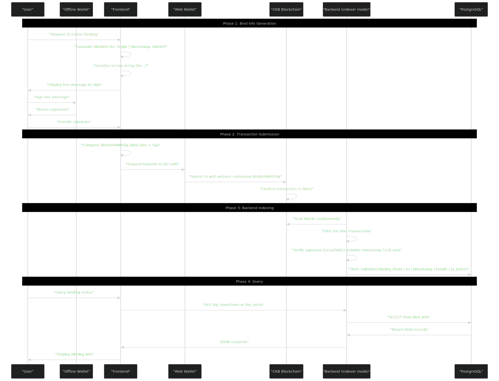

## System Overview
The Address Bind System solves a key user experience problem: allowing users with offline wallets to prove ownership and link their addresses to web-based wallet addresses. This creates a verifiable, on-chain mapping between two addresses controlled by the same user.

The system consists of:
- A frontend that generates bind information and constructs transactions
- A Rust backend with dual operation modes (verify and indexer)
- A PostgreSQL database for indexed bind relationships
- On-chain transactions on CKB blockchain containing signed bind proofs

The binding relationship is cryptographically secured: users sign a message with their offline wallet's private key, proving ownership of the source address. The backend verifies this signature and stores the validated relationship for efficient querying.


## Architecture Components
The following diagram shows the major components and their relationships:


Component Descriptions:
| Component | Purpose |
| --- | --- |
| CLI Entry Point | Parses command line arguments and schedules to verify or indexer mode |
| Verify Command | Encrypts bind transaction (signature + timestamp) verification |
| Indexer Service | Scans blockchain, verifies bind, stores to database and provides API service |
| REST API | Exposes three query endpoints to retrieve bind relationships |
| PostgreSQL Database | Stores validated bind relationships in `bind_info` and index status in `sync_status` table |

## Data Flow and Workflow
The complete binding workflow involves offline signing, on-chain submission, backend verification, and database storage:


Workflow Steps:
1. Generate `BindInfo`: Create a message containing the target `Script` and the current `timestamp` (Unix milliseconds)
2. Serialize to Hex: Convert the `BindInfo` to a molecule-encoded hex string with 0x prefix
3. Sign Message: Use an offline wallet (e.g., Neuron) to sign the hex string
4. Combine `BindInfoWithSig`: Combine `bind_info` and `sig` into a single structure
5. Submit Transaction: Use a web wallet to transfer CKB to yourself, placing `BindInfoWithSig` in the witness field
6. Backend Verification: Scanner verifies the signature and checks if the timestamp is within ±20 minutes of the block time
7. Store Binding: If valid, store to database; later timestamps from the same source address will update the existing binding
8. Query API: Frontend retrieves binding relationships through REST endpoints

## Backend Modes
The backend operates in two distinct modes via the `Commands` enum:

### Verify Mode
Single-transaction validation mode for testing or one-off checks:


Usage:
```bash
address-bind-be verify -t <tx_hash>
```

Example Output:
> tx 024bf0f881b020e91384c2b83258cac99fcc93c049dc8e2b138c90ef7bca7ce3 has valid bind info, 
from: ckt1qzda0cr08m85hc8jlnfp3zer7xulejywt49kt2rr0vthywaa50xwsq..., 
to: ckt1qzda0cr08m85hc8jlnfp3zer7xulejywt49kt2rr0vthywaa50xwsq..., 
timestamp: 1760432079687

### Indexer Mode
Long-running service that scans the blockchain, verifies binds, stores to database, and provides REST API service:


Usage:
```bash
address-bind-be indexer -s <start_height> -d <db_url> -p <port>
```

Key Features:
- Continuous blockchain scanning from specified start height
- Automatic persistence of indexer state in `sync_status` table
- Concurrent API serving while scanning (via Tokio async runtime)
- Updates bind relationships when later timestamps are found for same source address

### Data Structure
The system uses two primary molecule-encoded data structures:

**BindInfo**
Core message that represents a binding request:

| Field | Type | Description |
| --- | --- | --- |
| `to` | `Script` | Target address lock script (web wallet) |
| `timestamp` | `Uint64` | Unix timestamp in milliseconds when binding was created |

Molecule structure:
```rust
struct BindInfo {
    to: Script,
    timestamp: Uint64,
}
```

The `timestamp` serves two purposes:
- Replay Protection: Prevents reuse of old signatures
- Update Mechanism: Later timestamps override earlier bindings from same source

**BindInfoWithSig**
Complete binding proof including cryptographic signature:

| Field | Type | Description |
| --- | --- | --- |
| `bind_info` | `BindInfo` | Core binding request message |
| `sig` | `Bytes` | ECDSA signature from offline wallet's private key |

Molecule structure:
```rust
struct BindInfoWithSig {
    bind_info: BindInfo,
    sig: Bytes,
}
```

Verification Process:
1. Hash the serialized `BindInfo` using Blake2b
2. Recover public key from `sig` and hash using secp256k1
3. Derive lock script from recovered public key (the "from" address)
4. Verify timestamp is within ±20 minutes of block timestamp
5. Store mapping: `from_address → to_address` with timestamp and block coordinates

## REST API Overview
The indexer mode exposes a REST API for querying bind relationships:

### Endpoint Summary

| Endpoint | Method | Purpose | Return Format |
|------|------|------|----------|
| `/health` | GET | Health check | `{"status": "OK"}` |
| `/by_from/{from}` | GET | View all mappings for a source address | Array of `{to, height, tx_index}` |
| `/by_to/{to}` | GET | Query all mappings for a target address | Array of `{from, height, tx_index}` (latest per source) |
| `/by_to_at_height/{to}/{height}` | GET | Historical binding at a specific height | Array of `{from, height, tx_index}` (latest per source up to height) |

### Query Patterns

**By Source Address:**
```
GET /by_from/ckt1qzda0cr08m85hc8jlnfp3zer7xulejywt49kt2rr0vthywaa50xwsq...
```
Response: All target addresses this source has bound to (all timestamps)

**By Target Address:**
```
GET /by_to/ckt1qzda0cr08m85hc8jlnfp3zer7xulejywt49kt2rr0vthywaa50xwsq...
```
Response: Current source addresses bound to this target (only latest timestamp per source)

**By Target Address at Specific Height:**
```
GET /by_to_at_height/ckt1qzda0cr08m85hc8jlnfp3zer7xulejywt49kt2rr0vthywaa50xwsq.../18977278
```
Response: Source addresses bound to this target at specific block height (point-in-time query)

### Response Example
All endpoints return JSON arrays with block coordinates for tracking:

```json
[
  {
    "height": 18977278,
    "tx_index": 1,
    "to": "ckt1qzda0cr08m85hc8jlnfp3zer7xulejywt49kt2rr0vthywaa50xwsq..."
  }
]
```

The `height` and `tx_index` fields allow clients to:
- Track when bindings were created
- Order multiple bindings chronologically
- Implement point-in-time queries
- Verify bindings by checking on-chain transactions

### Use Cases
**Primary Use Case: Offline-to-Web Wallet Linking**

Users who hold assets in offline wallets (like Neuron) can prove ownership and link to web wallets for:
- Participating in web-based DApps without exposing offline wallet private keys
- Consolidating identity across wallet types
- Enabling governance participation from secure cold storage

### Update Mechanism
The system allows address rebinding:
- Same source address can bind to different target addresses over time
- Later `timestamp` values override earlier bindings
- All historical bindings are preserved in database with block coordinates
- `/by_from/:from` returns full history; `/by_to/:to` returns only current bindings

### Query Optimization
The three-endpoint design optimizes for different access patterns:
- Forward lookup (`/by_from`): "What addresses is this source bound to?" (e.g., wallet migration tracking)
- Reverse lookup (`/by_to`): "Who is currently bound to this target?" (e.g., DApp authorization checks)
- Historical lookup (`/by_to_at_height`): "Who was bound at block X?" (e.g., snapshot-based governance)

## System Properties

### Security
- **Cryptographic Proof**: Signature verification ensures only private key holder can create binding
- **Timestamp Validation**: ±20 minute window prevents replay attacks and ensures freshness
- **On-Chain Immutability**: All bindings are permanently recorded on CKB blockchain

### Scalability
- **Indexed Queries**: PostgreSQL enables efficient lookups without scanning blockchain
- **Continuous Sync**: Indexer automatically processes new blocks
- **Stateless Verification**: Verify mode can validate any transaction independently

### Trust Model
- **Hybrid Architecture**: Blockchain provides trust-minimized source of truth; backend provides convenience layer
- **Verifiable**: All bindings can be independently verified from on-chain data
- API Centralization: REST API is centralized convenience service; clients can run their own indexer

## Summary
Address binding system provides a secure, verifiable way to link offline wallets and web wallets. Through encrypted signatures and on-chain witnessing, ensures the truthfulness of binding relationships.

### Key Points
- Uses molecule encoded `BindInfo` and `BindInfoWithSig` data structures
- Backend supports verify (single transaction validation) and indexer (continuous service) modes
- REST API provides three endpoints for querying binding relationships
- Timestamp mechanism supports binding updates and replay protection