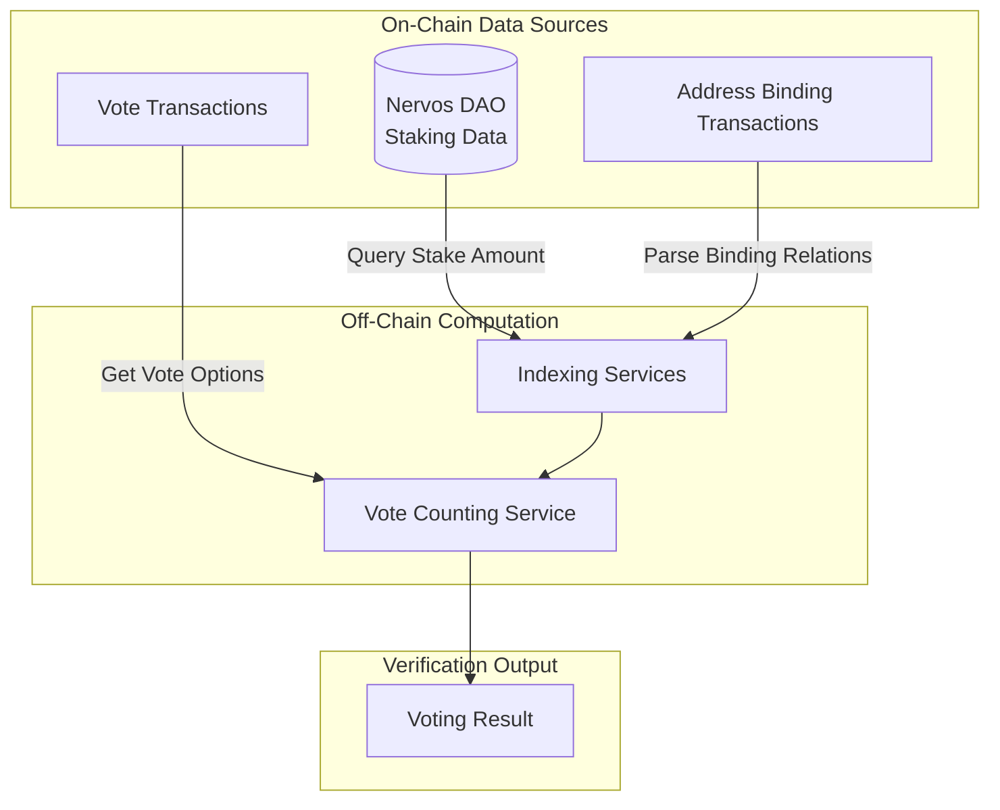
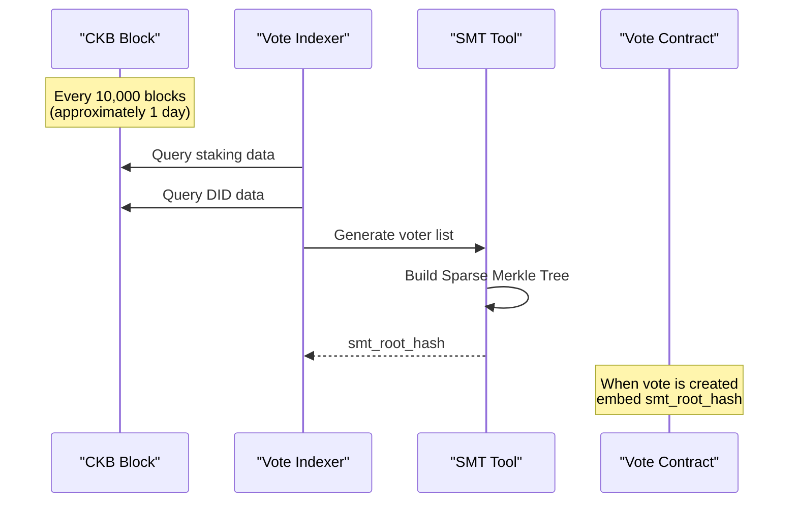

# Decentralization and Auditability

CCFDAO 1.1 is a community governance system built on the Web5 technology architecture. This document details the decentralized design principles, data transparency mechanisms, and how community members can independently verify voting results—addressing concerns about potential centralization risks in the system.

## System Overview

### Code Repositories

**Shared Infrastructure Services** (shared with other Web5 applications):

| Service | Repository | Description |
|---------|------------|-------------|
| PDS | https://github.com/web5fans/rsky | Personal Data Storage Service |
| Web5 DID Indexer | https://github.com/web5fans/web5-indexer | DID indexing service |
| DID CKB Contract | https://github.com/web5fans/did-ckb | On-chain DID smart contract |
| Relayer| https://github.com/web5fans/indigo | Relayer service |

**CCFDAO 1.1 Specific Services**:

| Service | Repository | Description |
|---------|------------|-------------|
| App View | https://github.com/CCF-DAO1-1/app_view | Application view service |
| Frontend | https://github.com/CCF-DAO1-1/ckb-fund-dao-ui | User interface |
| Address Bind Indexer | https://github.com/CCF-DAO1-1/web5-components/tree/main/address-bind/be | Address binding indexer |
| Vote Indexer | https://github.com/web5fans/web5-indexer | Vote indexer (shares code with DID Indexer) |
| NervosDao Indexer | https://github.com/web5fans/web5-indexer | NervosDao indexer (shares code with DID Indexer) |
| Vote Contract | https://github.com/CCF-DAO1-1/ckb-dao-vote | On-chain voting smart contract |
| Documentation | https://github.com/CCF-DAO1-1/ccfdao-v1.1-docs | This documentation repository |

## Core Voting System Requirements

The voting system is designed around the following core principles:

1. **Independently Verifiable Results**: Community members can independently calculate voting results using only on-chain data, ensuring transparency and trustworthiness
2. **Consistency with Metaforo**: Vote counting and weight rules remain consistent with the original Metaforo platform

### Detailed Requirements

| Requirement | Description |
|-------------|-------------|
| Address Binding | Supports Neuron wallet stakers binding to CKB addresses for easier voting; PW Lock addresses are automatically bound to their corresponding Omni Lock addresses |
| Vote Changing | Users can vote multiple times, with only their last vote counting |
| Vote Cancellation | Users can cancel their votes, which are then excluded from final results |
| Dynamic Weights | Users can change their voting weight at any time during voting by adding/removing address bindings or adjusting their stake |
| Proposal Threshold | Only users with weight greater than 100,000 can create proposals |
| Voting Eligibility | Only users with weight greater than 0 can participate in voting |
| Binding Conflict Resolution | Each Neuron address can only bind to one address; multiple changes use the latest binding; if a bound address votes independently, its own vote takes precedence and the binding becomes void |

## Voting System Architecture

### Core Formula

```
Voting Result = Group_Sum(User Vote Option, User Weight)
Where: User Weight = Voting Address Weight + Bound Address Weights + Potential PW-Lock Weight
```

### Critical On-Chain Data

To achieve transparency and trustworthiness, all critical data is stored on-chain:



| Data Type | Storage Location | Description |
|-----------|-----------------|-------------|
| Address Weight | On-chain CKB (Nervos DAO) | Amount staked by address in Nervos DAO |
| Address Binding Relations | CKB On-chain Transactions | Binding relations added/removed via transactions |
| User Votes | CKB On-chain Contract | Vote Cells store voting options |

For detailed information on address binding, see the [Address Binding System](./address-binding) documentation.

## Vote Contract Design Trade-offs

The vote contract is designed for general-purpose use to support future property management team elections and other scenarios:

### Design Decisions

| Design Element | General Design | DAO 1.1 Actual Usage |
|----------------|---------------|---------------------|
| `smt_root_hash` | Optional field | **Required**, represents the root hash of the SMT containing the eligible voter list |
| `extra` | Optional field | **Required**, stores the hash of the proposal content |
| Voting Options | Multiple choice (bitwise OR) | Single choice (0-Abstain, 1-Yes, 2-No), multiple selections considered invalid |
| Time Fields | `start_time`/`end_time` | Fixed to 0, actual times computed off-chain; start time is VoteMeta transaction block time, end time is start plus fixed duration(42/18 Epoch) |

### Contract Verification Logic

The vote contract performs only two critical checks:

1. **Membership Verification**: Verifies through the proof in the witness that the voting address is in the SMT voter list
2. **Option Validity**: Validates that the voting option is legitimate

All other checks (time range, invalid vote filtering, etc.) are performed in the off-chain vote counting service.

### User Experience Optimization

To minimize CKB occupation for voting users:
- Typical Vote Cell size: 118 CKB
- Users can destroy the Cell immediately after voting to reclaim their CKB
- Only two transaction fees need to be paid

## Eligible Voter List Deep Dive

Community concerns have focused on the collection and update mechanisms for the eligible voter list. The term "whitelist" was previously used in code and documentation, which may have raised concerns about centralized censorship capabilities. This has been replaced with the more neutral term "voter list" throughout.

### Voter List Source

In principle, the eligible voter list is straightforward: **the list of users who have staked CKB in Nervos DAO**, which already on the CKB chain.

### Technical Limitations and Solutions

| Limitation | Description | Solution |
|------------|-------------|----------|
| Contract Cannot Directly Reference | Vote contract cannot directly read Nervos DAO data on-chain | Use off-chain service to collect and assemble into SMT |
| List Too Large | Mainnet has 16,407 addresses staking CKB; direct usage would make transactions slow and expensive | Filter to: stakers who have a DID |

### Rationale for Filtering to DID Users

The voter list is filtered to "users who have staked in Nervos DAO AND have a Web5 DID" based on the following:

1. **Participation Data**: For the DAO 1.1 proposal vote, fewer than 500 people participated, representing a small fraction of total stakers
2. **Technical Architecture Consistency**: DAO 1.1 uses Web5 technology; users without a DID cannot interact with the system
3. **Data Transparency**: Whether a user has a DID is also on-chain data; this filter does not reduce transparency or trustworthiness

### Voter List Update Mechanism



| Parameter | Value | Description |
|-----------|-------|-------------|
| Update Cycle | 10,000 blocks | Approximately 1 day |
| Update Content | DID + Staking Data | Dual-condition filtering |
| Storage Method | SMT Root Hash | 32 bytes stored on-chain |

## Community Verification Method

Although the entire voting process involves complex steps and rules, all data originates from the CKB chain, and the intermediate processing is purely mechanical data transformation with no subjective intervention. Community members can obtain data from the chain and, following the same steps and rules, will arrive at the same voting results.

Verification process summary:
* 1 - 5: Obtain information related to the vote.
* 6 - 10: Verify the voter list.
* 11 - 15: Verify the vote counting results.

### Detailed Verification Process

#### 1. Locate the Voting Transaction

Find any user who participated in the vote and examine their wallet transaction history for a voting transaction similar to [this one](https://explorer.app5.org/transaction/0x53886a927baa175e08e99345e52546a7be4570081189890308e736a7f3b883b9).

Feature: Type CodeHash is `0x38716b429cb139405d32ff86a916827862b2fa819916894848d8460da8953afb`

Example of a voting Cell:

```json
{
  "capacity": "0x2bf55b600",
  "lock": {
    "codeHash": "0x9bd7e06f3ecf4be0f2fcd2188b23f1b9fcc88e5d4b65a8637b17723bbda3cce8",
    "hashType": "type",
    "args": "0xfbd94b915f05d05f669e7f96c7290fbf26b93d96"
  },
  "type": {
    "codeHash": "0x38716b429cb139405d32ff86a916827862b2fa819916894848d8460da8953afb",
    "hashType": "type",
    "args": "0x8594d2dbaa9b72f7bed5bd17ae50f16673bb782f"
  },
  "data": "0x02000000"
}
```


#### 2. Get VoteMeta

Parse the `cellDeps` from the voting transaction:

```json
[
  {
    "outPoint": {
      "txHash": "0xd8cb3f3b109ab35e51cb0c849f2b66159e376e125c6b701d193a6a636eb3247d",
      "index": "0x0"
    },
    "depType": "code"
  },
  {
    "outPoint": {
      "txHash": "0x4c67178b3b0fb2ae88a360b81f03f4f34ef06253906b38dcfdb00ac2b2cf35f4",
      "index": "0x0"
    },
    "depType": "code"
  },
  {
    "outPoint": {
      "txHash": "0x71a7ba8fc96349fea0ed3a5c47992e3b4084b031a42264a018e0072e8172e46c",
      "index": "0x0"
    },
    "depType": "depGroup"
  }
]
```

Exclude:
- `cellDep[0]`: Vote contract itself
- `cellDep[2]`: secp256k1/blake160

The remaining `cellDep[1]` is the VoteMeta dependency, whose outpoint points to the VoteMeta Cell.

#### 3. Determine Voting Time Range

- **Start Height**: Block height where VoteMeta transaction was included (example: 18,807,213)
- **Epoch Representation**: 13801 463/1073
- **End Epoch**: Start Epoch + 42 = 13843 463/1073
- **End Height**: Corresponding block height (example: 18,861,258 Epoch Representation 13843 545/1263)

> **Note**: CKB epoch length is not fixed; requires calculation and trial. Since epoch 13843 has epoch len 1263, convert the fractional part proportionally to 545/1263 (round up when not divisible).

#### 4. Filter Vote Transactions

Filter all vote transactions within `[start height, end height]` by type.

#### 5. Parse VoteMeta

Use Molecule to deserialize the data of the VoteMeta Cell.

structure reference: [vote.mol](https://github.com/CCF-DAO1-1/ckb-dao-vote/blob/main/contracts/ckb-dao-vote/molecules/vote.mol#L13).

```
0x9b0000001800000038000000670000006f000000770000006cbbcea30306f401f4f8adc963d60cc8670c4603e25329bc755df0cfbc22d9972f000000100000001b00000024000000070000004162737461696e05000000416772656507000000416761696e737400043101cb0035e900043101fd0035e920000000217a69d19c517685466796fa3f9180d29f4661686ff9c3490c8c1b1f88a1e151
```

Deserialization result:

```javascript
VoteMeta {
  smt_root_hash: '0x6cbbcea30306f401f4f8adc963d60cc8670c4603e25329bc755df0cfbc22d997',
  candidates: [ 'Abstain', 'Agree', 'Against' ],
  start_time: 16804338456501224448n,
  end_time: 16804338671249589248n,
  extra: '0x217a69d19c517685466796fa3f9180d29f4661686ff9c3490c8c1b1f88a1e151'
}
```

The `smt_root_hash` is the root hash of the SMT containing this vote's voter list.

#### 6. Determine Voter List Update Height

The voter list update height is **the vote start height rounded down to the nearest 10,000 multiple**:

```
18,807,213 → 18,800,000
```

> **Edge Case Handling**: If the vote start height is just slightly above a 10,000 multiple (e.g., 18,807,002), due to block confirmation time, the actual voter list used might be from the previous update height (18,790,000). When verifying, try both heights.

Therefore, this vote's voter list is updated at **height 18,800,000**.

#### 7. Get DID User List

Query from the Web5 DID Indexer endpoint:

```
https://did-indexer.bbs.fans/did-set?until_height=18800000
```

Querying by block height according to the Voter List update

> If concerned about indexer data trustworthiness, the community can run their own indexer or implement their own based on open-source code.

#### 8. Query Address Bindings

For each address in the DID user list, call the Address Bind Indexer's `by_to_at_height` (query by Voter List update height):

```bash
curl -vv http://localhost:9533/by_to_at_height/ckt1qzda0cr08m85hc8jlnfp3zer7xulejywt49kt2rr0vthywaa50xwsqwu8lmjcalepgp5k6d4j0mtxwww68v9m6qz0q8ah/18800000
```

Example response:

```json
[{"height":18800000, "tx_index":1, "from":"ckt1qzda0cr08m85hc8jlnfp3zer7xulejywt49kt2rr0vthywaa50xwsqwu8lmjcalepgp5k6d4j0mtxwww68v9m6qz0q8ah"}]
```

Create a mapping table of voters and their bound addresses:

| DID Address | Bound Addresses |
|--------|---------|
| A | A1, A2, A3 |
| B | B1, B2, C |
| C | (pw lock) |

#### 9. Query Stake Amount

For the list of addresses that have DIDs, including their bound addresses (and pw lock), query the stake amount in the Nervos DAO indexer by Voter List update height one by one, and aggregate to the DID address according to the binding relationship.

```bash
curl -vv http://localhost:9533/query_dao_stake_until_height?until_height=18800000&ckb_list=ckt1qzda0cr08m85hc8jlnfp3zer7xulejywt49kt2rr0vthywaa50xwsqwu8lmjcalepgp5k6d4j0mtxwww68v9m6qz0q8ah
```

Example response:

```json
{
  ckt1qzda0cr08m85hc8jlnfp3zer7xulejywt49kt2rr0vthywaa50xwsqwu8lmjcalepgp5k6d4j0mtxwww68v9m6qz0q8ah: 100000
}
```

Remove DID addresses with 0 stake; the remaining DID address list constitutes the voter list.

#### 10. Verify SMT Root Hash

After obtaining the voter list:
1. Get each address's lock hash
2. Sort in ascending order by bytes
3. Assemble into SMT
4. Compare with the `smt_root_hash` from step 5

#### 11. Filter Invalid Votes
Based on all votes obtained in step 4:

| Order | Processing Rule | Description |
|-------|-----------------|-------------|
| 1 | Multiple Votes | Take only the last vote |
| 2 | Multiple Selections | Considered invalid |

#### 12. Query Address Bindings

For each address with valid votes, call the Address Bind Indexer's `by_to_at_height` (query at voting end height):

```bash
curl -vv http://localhost:9533/by_to_at_height/ckt1qzda0cr08m85hc8jlnfp3zer7xulejywt49kt2rr0vthywaa50xwsqwu8lmjcalepgp5k6d4j0mtxwww68v9m6qz0q8ah/18861258
```

Example response:

```json
[{"height":18861258, "tx_index":1, "from":"ckt1qzda0cr08m85hc8jlnfp3zer7xulejywt49kt2rr0vthywaa50xwsqwu8lmjcalepgp5k6d4j0mtxwww68v9m6qz0q8ah"}]
```

Form a mapping table of voters and their bound addresses:

| Primary Address | Bound Addresses |
|-----------------|----------------|
| A | A1, A2, A3 |
| B | B1, B2, C |
| C | - |

#### 13. Calculate Weights

For each address with valid votes, including their bound addresses (and pw lock), query the stake amount in the Nervos DAO indexer by voting end height one by one, and aggregate to the voting address according to the binding relationship.

```bash
curl -vv http://localhost:9533/query_dao_stake_until_height?until_height=18861258&ckb_list=ckt1qzda0cr08m85hc8jlnfp3zer7xulejywt49kt2rr0vthywaa50xwsqwu8lmjcalepgp5k6d4j0mtxwww68v9m6qz0q8ah
```

Example response:

```json
{
  ckt1qzda0cr08m85hc8jlnfp3zer7xulejywt49kt2rr0vthywaa50xwsqwu8lmjcalepgp5k6d4j0mtxwww68v9m6qz0q8ah: 100000
}
```

#### 14. Filter Invalid Weights

If a user votes independently while also bound to another address (like C bound to B in the example), B's weight does not include C's weight.

#### 15. Final Vote Count

Based on valid vote options and corresponding weights, calculate the final result:

| Option | Weight |
|-----|------|
| Agree | 200000 |
| Against | 100000 |

## Summary

CCFDAO 1.1 ensures decentralization and auditability through the following mechanisms:

| Dimension | Mechanism | Guarantee |
|-----------|-----------|-----------|
| Data Source | All from CKB chain | Tamper-proof, publicly transparent |
| Verification Logic | Contract only verifies membership and option validity | Clear rules, no subjective discretion |
| Computation Process | Mechanical data processing | Reproducible, verifiable |
| Community Oversight | Complete verification toolchain | Anyone can audit independently |

The system's transparency and trustworthiness are well assured. Any community member can completely independently verify the results of any vote by following the steps provided in this documentation, without needing to trust any centralized service or authority.
