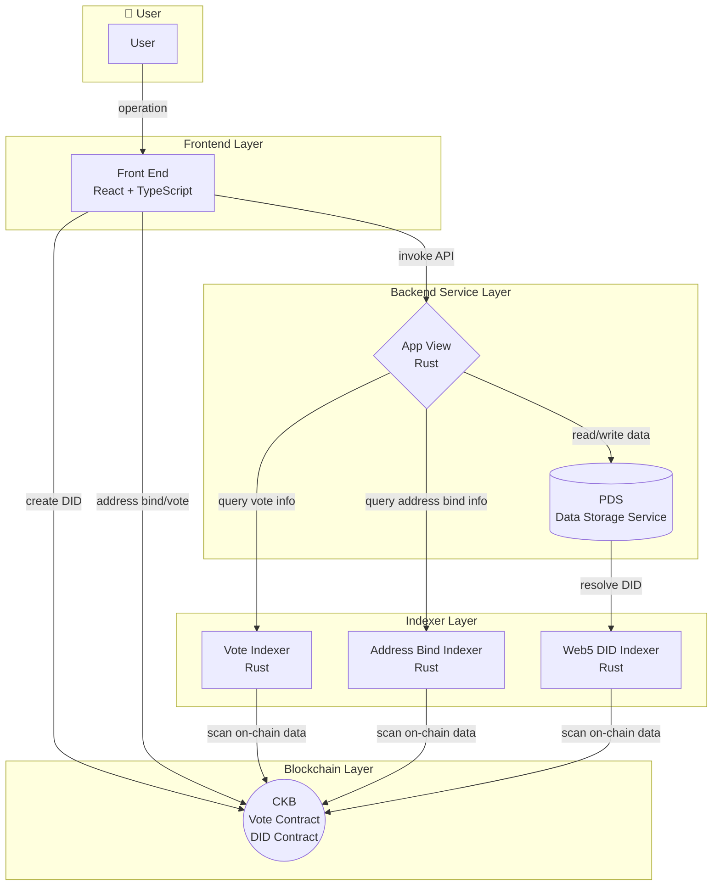

# Technical Overview

DAO v1.1 adopts the Web5 technology architecture, combining the user experience of Web2 with the decentralization advantages of Web3, providing users with a DAO governance platform featuring self-sovereign identity management and verifiable data.

## Technical Architecture

## Data Flow

1. **User Operation Flow**: Users interact through the frontend interface, which calls the App View API
2. **DID Creation**: When users create a DID, they interact directly with the CKB blockchain
3. **Address Binding & Voting**: When users bind addresses or vote, transactions are submitted directly to the CKB blockchain
4. **Data Query**: App View queries on-chain data through various indexers for fast data access
5. **User Data Management**: User personal data is stored in PDS through App View

## Component Introduction

### Front End

The frontend user interface, built with React + TypeScript. It provides the following core features:

- **User Registration & Login**: Supports users in creating and managing Web5 DID identities
- **Address Binding**: Allows users to bind CKB addresses to their DID identity
- **Proposal Management**: Create, view, and manage DAO proposals
- **Voting Operations**: Participate in proposal voting with on-chain vote verification

### App View (Application Service)

An information aggregation service developed in Rust. As the core middleware of the system, it handles:

- **Request Processing**: Receives and processes API requests from the frontend
- **Blockchain Interaction**: Interacts with the CKB blockchain for data operations
- **Data Coordination**: Performs read/write operations with the PDS data storage service
- **Index Queries**: Queries on-chain data status from various indexers

### PDS (Personal Data Server)

A data storage service developed in Rust, implemented based on [AT Protocol](https://atproto.com/):

- **User Data Storage**: Securely stores user personal data and proposal-related information
- **Data Verifiability**: Ensures data integrity and verifiability
- **Data Portability**: Users can migrate data between different PDS instances or even deploy their own PDS

### Web5 DID Indexer

A DID indexer service developed in Rust:

- **On-chain Scanning**: Continuously scans DID information on the blockchain
- **Data Indexing**: Stores DID data in a structured format in the database
- **Query Interface**: Provides efficient DID query APIs

### Address Bind Indexer

An address binding indexer service developed in Rust:

- **Binding Information Scanning**: Scans address binding transactions on the blockchain
- **Relationship Mapping**: Maintains the binding relationship between DIDs and CKB addresses
- **Query Service**: Provides query interface for address binding information

### Vote Indexer

A voting indexer service developed in Rust:

- **Vote Data Scanning**: Scans voting transactions on the blockchain
- **Vote Statistics**: Aggregates and calculates voting results
- **Query Interface**: Provides real-time voting information query service

### CKB Smart Contracts

Smart contracts deployed on the CKB blockchain, developed in Rust:

#### DID Contract

- **DID Storage**: Stores user DID information on-chain
- **Lifecycle Management**: Supports DID creation, transfer, update, and destruction operations
- **Identity Verification**: Provides on-chain identity verification capabilities

#### Vote Contract

- **Vote Storage**: Stores user voting information on-chain
- **Vote Item Creation**: Supports creating new voting items
- **Voter List Verification**: Verifies voter eligibility

## Tech Stack

| Component | GitHub | Tech Stack | Description |
|-----------|--------|------------|-------------|
| Front End | https://github.com/CCF-DAO1-1/ckb-fund-dao-ui | React + TypeScript | Modern frontend framework with excellent developer experience and type safety |
| App View | https://github.com/CCF-DAO1-1/app_view | Rust | High-performance backend service ensuring system stability and security |
| PDS | https://github.com/web5fans/rsky | Rust | Data storage service based on AT Protocol |
| Web5 DID Indexer | https://github.com/web5fans/web5-indexer/blob/master/src/db/did.rs | Rust | DID indexing service |
| Address Bind Indexer | https://github.com/CCF-DAO1-1/web5-components/blob/dev/address-bind/be/src/indexer.rs | Rust | Address binding indexing service |
| Vote Indexer | https://github.com/web5fans/web5-indexer/blob/master/src/db/vote.rs | Rust | Voting indexing service |
| CKB Contracts (DID, Vote) | https://github.com/web5fans/did-ckb https://github.com/CCF-DAO1-1/ckb-dao-vote | Rust | Smart contracts on CKB blockchain, including DID and Vote contracts |

## Architecture Features

### 1. Self-Sovereign Identity

- **Decentralized Identity**: Uses [did:ckb](https://github.com/web5fans/web5-wips) based on CKB blockchain as user identity identifier
- **Wallet Control**: Users fully control their identity through their own wallet
- **Permissionless**: No third-party authorization required to create and manage identities

### 2. Verifiable Data

- **AT Protocol**: Uses the decentralized network protocol [AT Protocol](https://atproto.com/)
- **Tamper-Proof**: User data is verifiable, and platforms cannot tamper with user data
- **Data Sovereignty**: Users have full control over their data, can migrate between different PDS instances, or even use their own deployed PDS

### 3. Combining Web2 and Web3 Advantages

- **Web2 Experience**: Proposal-related operations provide Web2-level user experience with smooth and responsive interactions
- **Web3 Security**: Voting uses on-chain contracts to ensure the process is open and verifiable
- **Transparent & Trustworthy**: Address binding information is stored on-chain, ensuring user voting weights are publicly verifiable
