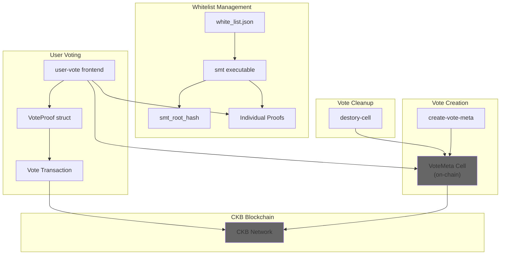
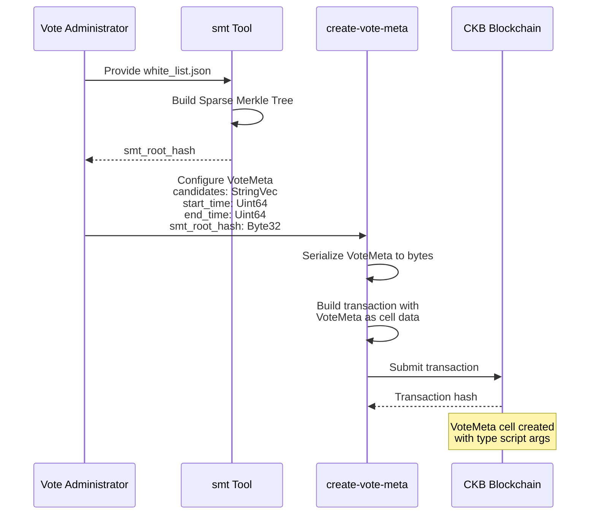
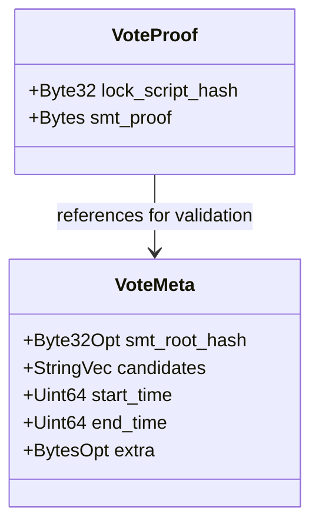
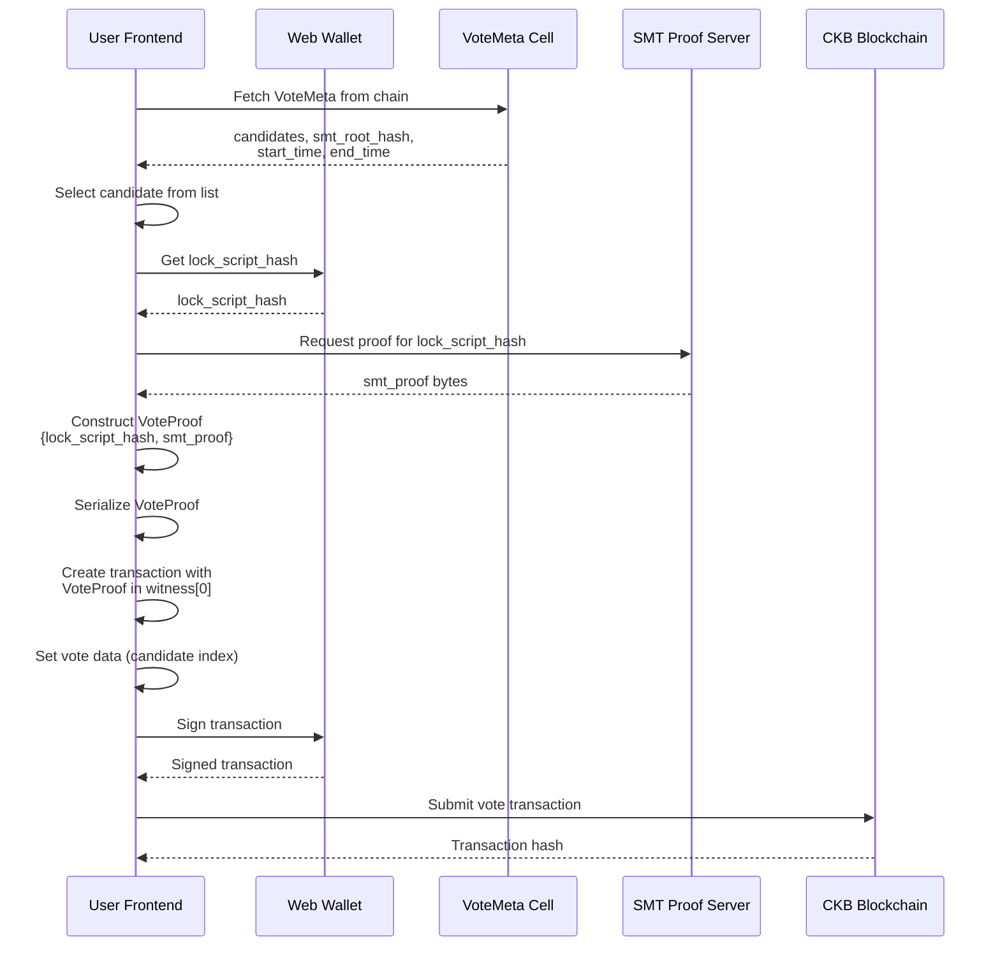
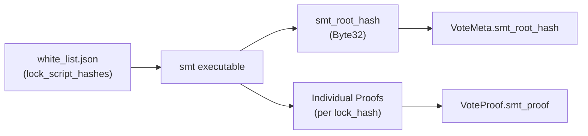
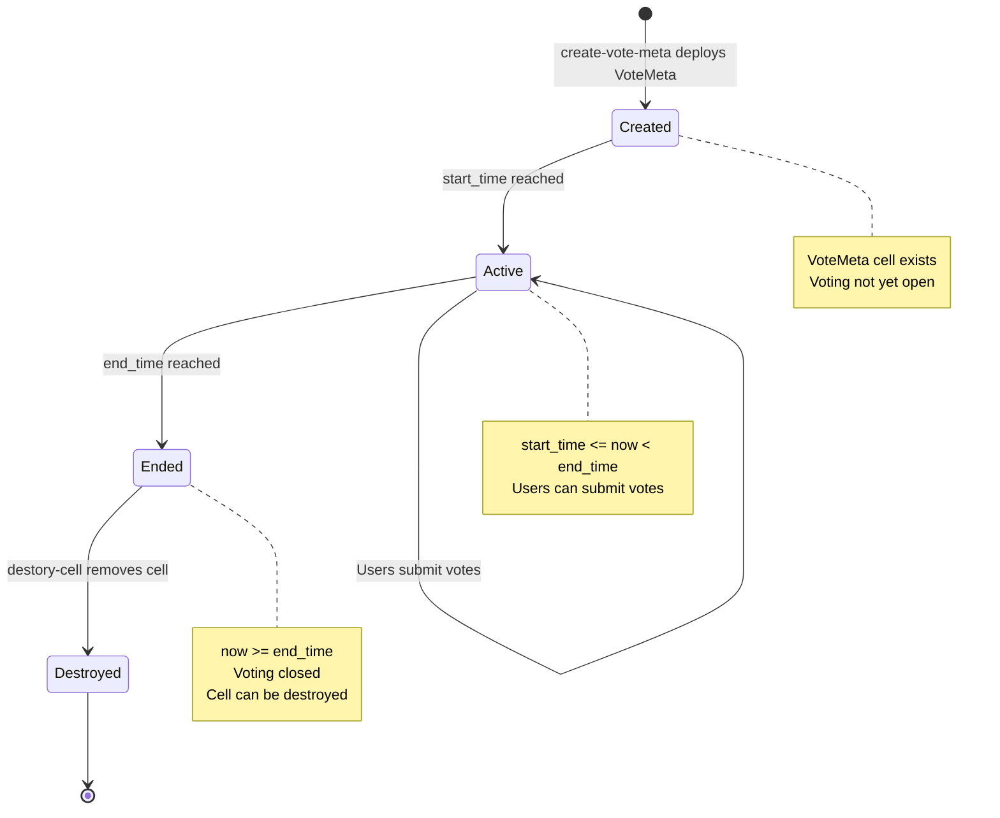

## System Overview
The Vote System provides a secure, on-chain voting mechanism for proposals. It allows users to create votes with multiple candidates, time-bound voting periods, and cryptographic whitelist verification using Sparse Merkle Trees (SMT).


### Component Overview Diagram



---

## Vote Creation Workflow

Vote creation involves generating a `VoteMeta` structure that defines the voting parameters and deploying it as a cell on the CKB blockchain.

### VoteMeta Structure

The `VoteMeta` structure is defined in Molecule schema and contains:

| Field | Type | Purpose |
|-------|------|---------|
| `smt_root_hash` | `Byte32Opt` | Root hash of the Sparse Merkle Tree for voter whitelist |
| `candidates` | `StringVec` | Vector of candidate names as strings |
| `start_time` | `Uint64` | Unix timestamp when voting period begins |
| `end_time` | `Uint64` | Unix timestamp when voting period ends |
| `extra` | `BytesOpt` | Optional additional metadata |

The `create-vote-meta` component constructs this structure and deploys it to the blockchain. The `smt_root_hash` field is critical for voter verification - it serves as a cryptographic commitment to the authorized voter list without revealing all voters on-chain.

### Vote Creation Flow



The example output shows a VoteMeta with:
- `candidates: [ 'no', 'not bad', 'good', 'awesome' ]`
- `start_time: 2305843009213694052n`
- `end_time: 2305843009213694094n`
- `smt_root_hash: '0x7e602b84ea55d05337c674f99c279b674a454c7186f0b8fc308291783dd59245'`
- `extra: '0x7ecd3c88a1ee095f66ac5690edc9b67feec822bc118c22c7ff67c99513ac107e'`

The resulting vote cell has a type script with `args: '0x456c88d8a9569d4881df935e4674a2fc96148917'`.

---

## Casting Votes

Users cast votes by constructing a transaction that includes a `VoteProof` structure in the witness, proving their eligibility via SMT membership proof.

### VoteProof Structure



The `VoteProof` structure contains:
- `lock_script_hash`: Hash of the voter's lock script (identifies the voter)
- `smt_proof`: Cryptographic proof that this lock_script_hash is in the authorized voter whitelist

### Voting Process Flow



### Example Vote Transaction

The user-vote frontend demonstrates a complete voting flow. Example output shows:

```
vote data:  0x04000000
vote proof:  0x540000000c0000002c000000abbfbf9155679b5d1399b4aa04dac6f3f71e63fd3ae4759110a415169eefeeed240000004c4fff50378f5d8873eed84dbfd327bd9b258f2e0a262364b6fd5cb0550e799dba067da4
```

The transaction witness contains:
- Position 0: Signature and VoteProof structure
- The VoteProof is hex-encoded and includes the lock_script_hash and smt_proof

The transaction structure includes:
- Input cells: User's capacity cells for fees
- Output cells: Vote cell with type script referencing VoteMeta
- Witnesses: `[0]` contains signature, `[1]` contains VoteProof
- Output data: Selected candidate (encoded as bytes)

### Setup and Execution

The user-vote component is a TypeScript frontend application:

```bash
npm install
npm start
```

Dependencies include:
- `@ckb-ccc/ccc`: CKB wallet integration library
- `@ckb-ccc/core`: Core CKB functionality
- `ts-node`: TypeScript execution
- `typescript`: TypeScript compiler

---

## SMT Whitelist Tool

The Sparse Merkle Tree (SMT) tool processes a voter whitelist and generates cryptographic proofs for efficient on-chain verification.

### SMT Architecture



### Whitelist Processing

The `smt` command-line tool:

1. **Input**: Reads `white_list.json` containing array of authorized lock script hashes
2. **Processing**: Constructs a Sparse Merkle Tree from the lock hashes
3. **Output**: 
   - Single `smt_root_hash` (32 bytes) - embedded in VoteMeta
   - Individual proofs for each lock_hash - provided to voters

### Proof Generation

For each authorized voter in the whitelist, the SMT tool generates a unique membership proof. This proof allows on-chain verification that a given lock_script_hash is in the authorized set without revealing the entire whitelist.

The proof is compact (variable length bytes) and can be verified efficiently on-chain by:
1. Taking the voter's `lock_script_hash`
2. Taking the `smt_proof` bytes
3. Recomputing the tree root
4. Comparing against `VoteMeta.smt_root_hash`

---

## Vote Data Models

The Vote System uses Molecule schema for deterministic serialization of data structures.

### Molecule Schema Definition

The complete schema is defined in [vote/molecules/vote.mol:1-21]():

```
array Uint64 [byte; 8];

vector Bytes <byte>;
option BytesOpt (Bytes);

vector String <byte>;
option StringOpt (String);
vector StringVec <String>;

table VoteMeta {
    smt_root_hash: Byte32Opt,
    candidates: StringVec,
    start_time: Uint64,
    end_time: Uint64,
    extra: BytesOpt,
}

table VoteProof {
    lock_script_hash: Byte32,
    smt_proof: Bytes,
}
```

### Type Definitions

| Type | Definition | Usage |
|------|------------|-------|
| `Uint64` | Fixed 8-byte array | Timestamps (start_time, end_time) |
| `Bytes` | Variable-length byte vector | Generic byte data |
| `BytesOpt` | Optional Bytes | Extra metadata, optional fields |
| `String` | Byte vector representing string | Individual candidate name |
| `StringVec` | Vector of String | List of candidates |
| `Byte32` | 32-byte array (inherited) | Lock script hashes, SMT root |
| `Byte32Opt` | Optional Byte32 | SMT root hash |

### VoteMeta Table Structure

The `VoteMeta` table uses Molecule's table encoding which provides:
- Field presence verification
- Deterministic serialization
- Efficient parsing

Fields are serialized in order:
1. `smt_root_hash` (optional 32 bytes)
2. `candidates` (variable length vector of strings)
3. `start_time` (8 bytes)
4. `end_time` (8 bytes)  
5. `extra` (optional variable length bytes)

### VoteProof Table Structure

The `VoteProof` table is simpler:
1. `lock_script_hash` (required 32 bytes) - Voter identity
2. `smt_proof` (variable length bytes) - Merkle proof

Example serialized VoteProof:
```
0x540000000c0000002c000000abbfbf9155679b5d1399b4aa04dac6f3f71e63fd3ae4759110a415169eefeeed240000004c4fff50378f5d8873eed84dbfd327bd9b258f2e0a262364b6fd5cb0550e799dba067da4
```

Breaking down:
- Total length: `0x54000000` (84 bytes)
- First field offset: `0x0c000000` (12 bytes header)
- Second field offset: `0x2c000000` (44 bytes)
- lock_script_hash: 32 bytes starting at offset 12
- smt_proof: Remaining bytes starting at offset 44

### Serialization in TypeScript

The user-vote frontend uses `@ckb-ccc/core` library which provides Molecule codec implementations for TypeScript. The library handles:
- Encoding structures to bytes
- Decoding bytes to JavaScript objects
- Type validation
- Deterministic serialization

---

## Vote Cell Management

Vote cells have a defined lifecycle and must be cleaned up after the voting period ends.

### Vote Cell Lifecycle



### Cell Destruction Process

The `destory-cell` utility handles cleanup of expired vote cells:

1. **Validation**: Checks that `current_time >= VoteMeta.end_time`
2. **Transaction Construction**: Creates transaction to consume the VoteMeta cell
3. **Capacity Recovery**: Returns cell capacity to administrator
4. **Submission**: Broadcasts destruction transaction to CKB network

This cleanup is necessary because:
- Vote cells occupy blockchain space
- Cell capacity is locked during voting period
- Completed votes no longer need on-chain storage
- Capacity can be recovered and reused

### Time Constraints

The voting period is strictly enforced by comparing:
- `VoteMeta.start_time`: Unix timestamp (Uint64) when voting opens
- `VoteMeta.end_time`: Unix timestamp (Uint64) when voting closes
- Current block timestamp

Valid vote transactions must satisfy:
```
start_time <= block_timestamp < end_time
```

### Type Script Identification

Vote cells are identified by their type script. In the example:
```
vote type args: 0x456c88d8a9569d4881df935e4674a2fc96148917
```

This type script args uniquely identifies the vote session. All vote transactions reference this type script to:
- Locate the VoteMeta cell
- Validate vote submissions
- Destroy the cell after completion

---

## System Integration

### Comparison with Address Bind System

| Aspect | Vote System | Address Bind System |
|--------|-------------|---------------------|
| **State Storage** | Fully on-chain (CKB cells) | Hybrid (on-chain + PostgreSQL) |
| **Backend Service** | None | Indexer service |
| **Data Verification** | SMT proofs | Signature verification |
| **Frontend** | user-vote | address-bind/fe |
| **Use Case** | Temporary voting sessions | Permanent address bindings |

### Key Characteristics

The Vote System is characterized by:

1. **Stateless Operation**: No backend indexer required
2. **On-chain Verification**: All validation via smart contracts
3. **Privacy-Preserving**: SMT allows whitelist verification without revealing full list
4. **Time-Bounded**: Explicit start and end times
5. **Immutable Records**: Votes permanently recorded on blockchain

This architecture contrasts with the Address Bind System's approach of maintaining off-chain indexes for query efficiency.