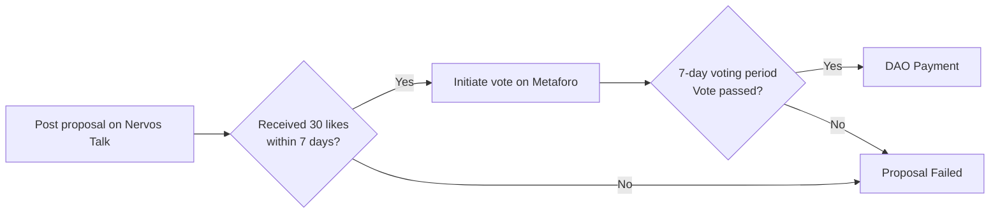

## DAO v1.0: Success and Challenges

CKB Community Fund DAO (hereinafter referred to as "DAO") v1.0 was a successful community governance experiment that provided us with valuable experience. However, as the ecosystem evolved, its minimalist rules and fragmented governance tools/platforms revealed challenges in **operational efficiency, project oversight, and community participation experience**.

---

## DAO v1.0 Governance Process Review

The existing DAO v1.0 governance process heavily relies on voluntary actions from community members:

---

## 5 Structural Challenges in v1.0

By analyzing this process and communicating with former operational contributors, we identified five structural challenges at the procedural level in DAO v1.0:

### 1. Lack of Institutional Framework for Operations

The DAO treasury is managed by a 2/3 multisig Treasury Committee (Jan, Terry, Cipher), but there is ambiguity around key operational roles and processes: who monitors project progress, who verifies milestone deliverables, who formally notifies multisig holders for payments, and how treasury usage is disclosed.

In the past, some responsibilities (such as checking if proposals on Nervos Talk received 30 likes, verifying non-technical milestones, and notifying multisig holders for payments) were handled informally and voluntarily by community members, but this was not an institutional arrangement. This model of relying on individuals rather than mechanisms is fragile and unsustainable.

### 2. Misaligned Oversight Bottleneck

In the DAO v1.0 process, after voting approval and initial budget authorization, the DAO is completely absent from subsequent milestone oversight decisions. Milestone verification is informally handled by a single member, making it difficult to conduct comprehensive fact-checking and disclosure of diverse project deliverables across technical, marketing, and design domains.

This leads to two problems:
- Oversight may become superficial
- The DAO, as the ultimate decision-maker, is absent from continuous oversight of project execution

### 3. Fragmented Governance Tools

The current governance process spans multiple platforms: proposals and discussions on Nervos Talk, then formal voting on Metaforo. This fragmented experience not only increases participation costs and cognitive load for community members but also leads to scattered information and lost context, which is one of the key reasons for low governance participation.

### 4. Lack of Information Distribution Channels

During community discussion and voting, proposal dissemination relies on personal sharing by project teams or active community members, lacking official, neutral information channels. This creates information asymmetry, where core discussions cannot reach as many community members as possible in a timely manner, affecting the breadth and depth of decision-making.

Similarly, after project completion, the lack of information distribution channels constrains awareness and participation in the latest ecosystem developments both within and outside the community.

### 5. Critical Process Gaps

Projects lack formal completion reports and processes, preventing knowledge accumulation, experience reuse, and the DAO's ability to learn and grow from past grants. This process gap means each new project must start from scratch, unable to establish systematic project management and knowledge accumulation mechanisms.

---

## The Core Dilemma

These issues collectively point to a core dilemma:

> **DAO v1.0 has democratic decision-making mechanisms but severely lacks professional, continuous procedural services to support the effective implementation of these decisions.**

---

## DAO v1.1 Solution

DAO v1.1 aims to address this dilemma by introducing two core components while preserving the core democratic spirit of v1.0 (such as voting weight based on Nervos DAO deposits).

### 1. DAO Stewards

A professional operations team serving the DAO, with clear treasury management and governance processes.

### 2. Web5-Based Governance Platform

A brand-new governance platform to replace the current fragmented tools and enhance the overall governance experience.
