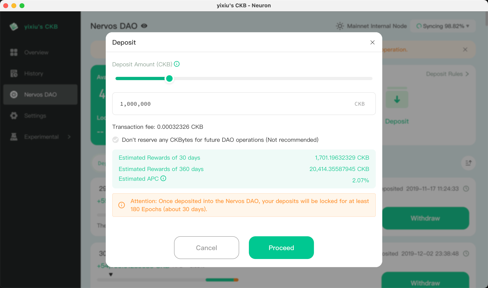

## Why Deposit to Nervos DAO?

Depositing CKB into Nervos DAO is a prerequisite for participating in CKB Community Fund DAO governance voting. Only CKB that is locked in Nervos DAO grants you corresponding voting weight.

<Callout title="What is Nervos DAO?" type="info">
Nervos DAO is a smart contract on the CKB chain that allows users to lock CKB to receive interest compensation (offsetting dilution from secondary issuance). CKB deposited into Nervos DAO requires a lock-up period before it can be withdrawn.
</Callout>

## Deposit Channels

There are currently two recommended ways to deposit into Nervos DAO:

| Channel | Suitable For | Features |
|---------|--------------|----------|
| [NervDAO](https://nervdao.com) | New users | No node sync required, low barrier, browser-based operation |
| [Neuron Wallet](https://github.com/nervosnetwork/neuron/releases) | Advanced users | Desktop wallet, requires full node sync, higher security |

---

## Method 1: Deposit via NervDAO Website (Recommended for Beginners)

[NervDAO](https://nervdao.com) is a lightweight web application that requires no software download or node synchronization - you can complete the deposit directly in your browser.

<Steps>

<Step>

### Connect Wallet

Visit [nervdao.com](https://nervdao.com) and click "Connect Wallet" to connect your wallet. Supports JoyID, MetaMask, and various other wallets.

</Step>

<Step>

### Deposit CKB

After connecting your wallet, switch to the Deposit tab, enter the amount of CKB you want to deposit, and click the "Deposit" button.

<Callout title="Minimum Deposit Amount" type="warning">
Depositing to Nervos DAO requires at least 102 CKB (to cover on-chain storage costs).
</Callout>

</Step>

<Step>

### Confirm Transaction

Confirm the transaction in your wallet and wait for it to be confirmed on-chain. Once confirmed, your CKB has been successfully deposited into Nervos DAO.

</Step>

</Steps>

---

## Method 2: Deposit via Neuron Wallet

[Neuron](https://github.com/nervosnetwork/neuron/releases) is the official Nervos desktop wallet, providing full node functionality and higher security.

<Callout title="Note" type="warning">
Neuron wallet requires syncing CKB full node data. Initial synchronization may take several hours or longer. Please ensure you have sufficient disk space and network bandwidth.
</Callout>

<Steps>

<Step>

### Download and Install Neuron

Go to the [Neuron Releases](https://github.com/nervosnetwork/neuron/releases) page, download the version for your operating system, and install it.

</Step>

<Step>

### Create or Import Wallet

For first-time use, you need to create a new wallet or import an existing one. Please keep your mnemonic phrase safe.

</Step>

<Step>

### Wait for Node Sync

Neuron will automatically start syncing CKB node data. You can check the sync progress at the bottom of the interface.

</Step>

<Step>

### Deposit to Nervos DAO

After the node sync is complete, go to the "Nervos DAO" tab, click the "Deposit" button, enter the deposit amount, and confirm the transaction.

</Step>

</Steps>

---

## Important Notes After Depositing

### Lock-up Period

CKB deposited into Nervos DAO has a lock-up period (approximately 30 days). During the lock-up period, your CKB cannot be withdrawn, but you can still participate in DAO voting.

### Withdrawal Process

Withdrawing CKB from Nervos DAO requires two steps:
1. **Initiate Withdrawal Request** - Start the unlock process
2. **Complete Withdrawal** - After the lock-up period ends, complete the final withdrawal

### Voting Weight

Your voting weight equals the total amount of CKB that is **currently locked** in Nervos DAO. CKB that has initiated withdrawal but not yet completed does not count toward voting weight.

---

## Next Steps

After depositing to Nervos DAO, you can:

- [Register Web5 DID](./register-web5-did) to claim your Web5 DID and participate in DAO governance voting.
