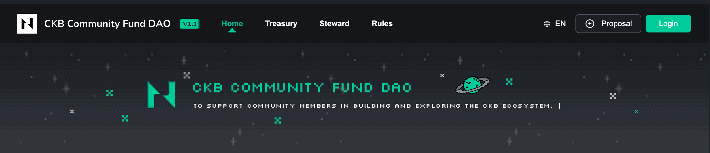
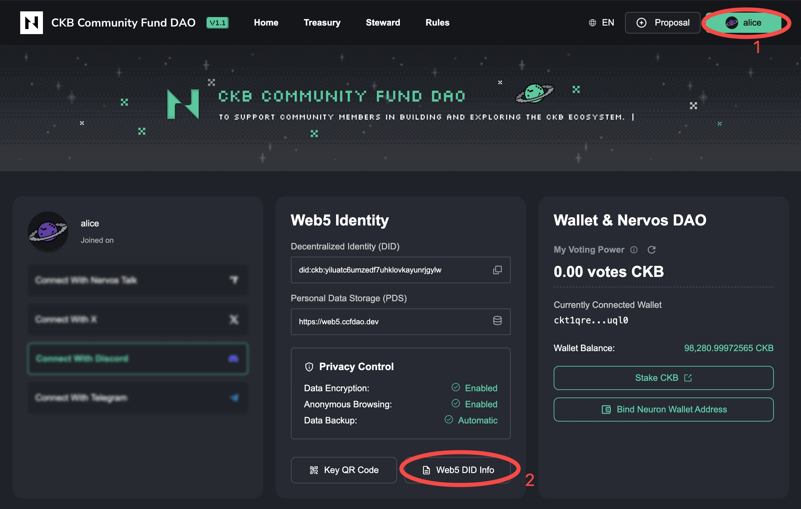

import step2 from './images/register-web5-did/step2.png';
import step3 from './images/register-web5-did/step3.png';
import step4 from './images/register-web5-did/step4.png';
import step5 from './images/register-web5-did/step5.png';
import step6 from './images/register-web5-did/step6.png';
import step7 from './images/register-web5-did/step7.png';
import step9 from './images/register-web5-did/step9.png';
import step10 from './images/register-web5-did/step10.png';
import step11 from './images/register-web5-did/step11.png';

## Prerequisites

Before you begin, please ensure you have completed the following preparations:

- A CKB wallet installed and configured (such as JoyID or other compatible wallets)
- At least 450 CKB in your wallet for on-chain storage when creating your Web5 DID. When you no longer need your Web5 DID, you can destroy it and the corresponding CKB will be refunded to your wallet.

## Registration Steps

### Step 1: Access CCF DAO and Login

Visit the CCF DAO official website🔗: https://ccfdao.dev , click the **Login** button in the top right corner of the page.
<Callout title="Note" type="warning">
ccfdao.dev is only for use during the public testing period. After the public testing ends, the DAO1.1 governance platform will launch with an official domain.
</Callout>

### Step 2: Choose Creation Method

In the "Create Account" dialog that appears, you can see the benefits of creating a Web5 DID account.

Click the **Connect Wallet to Create** button to start the creation process. If you already have a Web5 DID, you can click "Already have Web5 DID" to import it.

  

### Step 3: Connect Wallet

The system will prompt your wallet for connection authorization. After successful authorization, the page will display "Wallet Connected" status along with your wallet address.

Once you confirm the wallet is connected successfully, click **Next** to continue.

  

### Step 4: Set Account Name

In the "Set Name" step, enter your Web5 DID account name in the input field.

The name can consist of numbers, letters, or the special character `-`. This name will become your exclusive domain prefix (e.g., if you enter `alice`, your domain will be `alice.web5.ccfdao.dev`).

After setting the name, click **Next**.

  

### Step 5: Complete On-Chain Storage

In the "On-Chain Storage" step, you need to drag the planet icon on the left to the Nervos galaxy on the right to complete the on-chain storage operation.

After authorization, your Web5 account data will be permanently stored on the blockchain and cannot be tampered with by third parties.

  

### Step 6: Wait for On-Chain Confirmation

After dragging, the system will generate a CKB on-chain transaction. You need to sign and confirm it in your wallet, then wait for the on-chain transaction confirmation.

This process may take about 10-30 seconds. Please wait patiently during this time and **do not refresh the page**.

  

### Step 7: Creation Successful

When you see the "Account Created Successfully!" message, your Web5 DID account has been successfully created and stored on-chain.

The page will display your account information, including:
- Account avatar
- Account name
- Exclusive domain (e.g., `alice.web5.ccfdao.dev`)
- Associated wallet address

Click **Enter Community** to start your DAO journey!

  

## View and Manage Your Web5 Identity

### Access Profile Center

After logging in, click your username in the top right corner of the page to access the profile center.

Here you can view:
- **Web5 Identity**: Your Decentralized Identity (DID) and Personal Data Storage (PDS) address
- **Privacy Control**: Status of data encryption, anonymous browsing, data backup, and other settings
- **Wallet & Nervos DAO**: Voting power, wallet balance, and other information

### Export Web5 DID Information

For account security and cross-device usage, we recommend exporting and safely storing your Web5 DID information.

1. On the profile center page, click the **Web5 DID Info** button

2. The system will ask you to set an 8-character password (composed of numbers or letters) to protect the exported file

  

3. After entering the password, click **Confirm**

  

4. Click **Export File** to download the file containing your Web5 DID and login key

  

> ⚠️ **Important**: Please keep the exported file and password safe. If the key is leaked, your account is at risk of being stolen! The exported file can be used to log in on other devices or migrate to other websites that support Web5 technology.

## Next Steps

After completing Web5 DID registration, you can:

- [Bind Neuron Wallet Address](../getting-started/bind-nervosdao-address)
