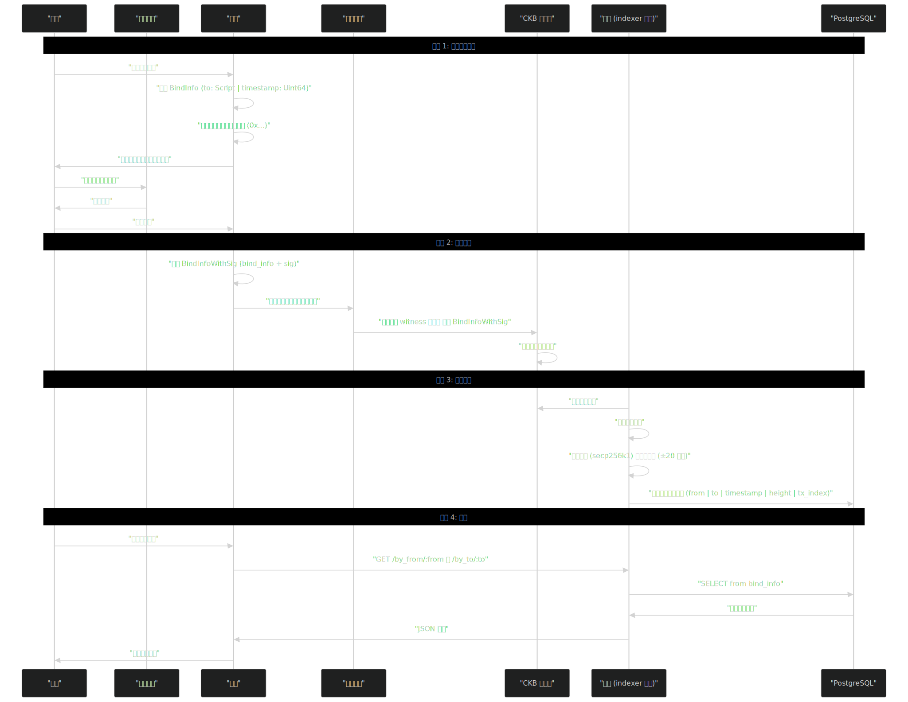

## 系统概述
地址绑定系统解决了一个关键的用户体验问题：允许拥有离线钱包的用户证明所有权并将其地址链接到基于网页的钱包地址。这在同一用户控制的两个地址之间创建了一个可验证的链上映射。

系统组成包括：
- 前端，用于生成绑定信息和构造交易
- Rust 后端，具有双重操作模式（verify 和 indexer）
- PostgreSQL 数据库，用于索引绑定关系
- CKB 区块链上的链上交易，包含签名的绑定证明

绑定关系通过加密方式保护：用户使用其离线钱包的私钥签署消息，证明对源地址的所有权。后端验证此签名并存储已验证的关系以供高效查询。


## 架构组件
下图显示了主要组件及其关系：


组件描述：
| 组件 |  目的 |
| --- | --- |
| CLI 入口点 | 解析命令行参数并调度到 verify 或 indexer 模式 |
| Verify 命令 | 以加密方式验证绑定交易（签名 + 时间戳） |
| Indexer 服务 | 扫描区块链、验证绑定、存储到数据库并提供 API 服务 |
| REST API | 暴露三个查询端点以便检索绑定关系 |
| PostgreSQL 数据库 | 存储包含已验证绑定的 `bind_info` 以及索引器状态表 `sync_status` |

## 数据流与工作流程
完整的绑定工作流程涉及离线签名、链上提交、后端验证和数据库存储：


工作流程步骤:
1. 生成 `BindInfo`: 创建包含目标 `Script` 和当前 `timestamp`（Unix 毫秒）的消息
2. 序列化为十六进制: 将 `BindInfo` 转换为带有 0x 前缀的 molecule 编码十六进制字符串
3. 签署消息: 使用离线钱包（例如 Neuron）签署十六进制字符串
4. 组合 `BindInfoWithSig`: 将 `bind_info` 和 `sig` 组合成单个结构
5. 提交交易: 使用网页钱包向自己转账 CKB，将 `BindInfoWithSig` 放在 witness 字段中
6. 后端验证: 扫描器验证签名并检查时间戳是否在区块时间的 ±20 分钟内
7. 存储绑定: 如果有效，存储到数据库；来自同一源地址的较晚时间戳会更新现有绑定
8. 查询 API: 前端通过 REST 端点查询绑定关系

## 后端模式
后端通过 `Commands` 枚举以两种不同的模式运行：

### Verify 模式
用于测试或一次性检查的单交易验证模式：


用法: 
```bash
address-bind-be verify -t <tx_hash>
```

示例输出:
> tx 024bf0f881b020e91384c2b83258cac99fcc93c049dc8e2b138c90ef7bca7ce3 has valid bind info, 
from: ckt1qzda0cr08m85hc8jlnfp3zer7xulejywt49kt2rr0vthywaa50xwsq..., 
to: ckt1qzda0cr08m85hc8jlnfp3zer7xulejywt49kt2rr0vthywaa50xwsq..., 
timestamp: 1760432079687

### Indexer 模式
用于持续扫描和索引绑定交易，并提供 REST API 的长期运行服务：


用法: 
```bash
address-bind-be indexer -s <start_height> -d <db_url> -p <port>
```

主要特性:
- 从指定起始高度持续扫描区块链
- 在 `sync_status` 表中自动持久化索引器状态
- 在扫描时并发提供 API 服务（通过 Tokio 异步运行时）
- 当为同一源地址找到较晚的时间戳时更新绑定关系

### 数据结构
系统使用两种主要的 molecule 编码数据结构：

**BindInfo**
表示绑定请求的核心消息：

| 字段 |	类型	|描述 |
| --- | ---  | --- |
| `to`	| `Script`	| 目标地址锁脚本（网页钱包）|
| `timestamp`	| `Uint64`	| 创建绑定时的 Unix 时间戳（毫秒）|

Molecule 结构:
```rust
table BindInfo {
    to: Script,
    timestamp: Uint64,
}
```

`timestamp` 有两个目的：
- 重放保护：防止重用旧签名
- 更新机制：较晚的时间戳会覆盖来自同一源的较早绑定

**BindInfoWithSig**
包含加密签名的完整绑定证明：

| 字段 |	类型	| 描述 |
| --- | ---  | --- |
| `bind_info`	| `BindInfo`	| 绑定请求消息|
| `sig`	| `Bytes`	| 来自离线钱包私钥的 ECDSA 签名|

Molecule 结构:
```rust
table BindInfoWithSig {
    bind_info: BindInfo,
    sig: Bytes,
}
```

验证过程:
1. 使用 Blake2b 对序列化的 `BindInfo` 进行哈希
2. 使用 secp256k1 从 `sig` 和哈希中恢复公钥
3. 从恢复的公钥派生锁脚本（即"from"地址）
4. 验证时间戳在区块时间戳的 ±20 分钟内
5. 存储映射：`from_address → to_address` 以及时间戳和区块坐标

## REST API 端点
indexer 模式暴露了一个 REST API 用于查询绑定关系：

### 端点摘要

| 端点 | 方法 | 目的 | 返回格式 |
|------|------|------|----------|
| `/health` | GET | 健康检查 | `{"status": "OK"}` |
| `/by_from/{from}` | GET | 查看源链的地址所有映射 | `{to, height, tx_index}` 数组 |
| `/by_to/{to}` | GET | 查询被链地址的所有映射 | `{from, height, tx_index}` 数组 （每个源的最新） |
| `/by_to_at_height/{to}/{height}` | GET | 特定高度的历史绑定 | `{from, height, tx_index}` 数组 (截至高度每个源的最新) |

### 查询模式

**按源地址查询：**
```
GET /by_from/ckt1qzda0cr08m85hc8jlnfp3zer7xulejywt49kt2rr0vthywaa50xwsq...
```
响应：此源已绑定到的所有目标地址（所有时间戳）

**按目标地址查询：**
```
GET /by_to/ckt1qzda0cr08m85hc8jlnfp3zer7xulejywt49kt2rr0vthywaa50xwsq...
```
响应：绑定到此目标的当前源地址（每个源仅最新时间戳）

**按目标地址在特定高度查询：**
```
GET /by_to_at_height/ckt1qzda0cr08m85hc8jlnfp3zer7xulejywt49kt2rr0vthywaa50xwsq.../18977278
```
响应：在特定区块高度绑定到此目标的源地址（时间点查询）

### 响应示例

所有端点返回同类结块端验证 JSON 格着用于调整：
```json
[
  {
    "height": 18977278,
    "tx_index": 1,
    "to": "ckt1qzda0cr08m85hc8jlnfp3zer7xulejywt49kt2rr0vthywaa50xwsq..."
  }
]
```

`height` 和 `tx_index` 字段允许所需定：
- 验证历史相题时间
- 按时间顺序排列不等序
- 实现时间点查询
- 通过链整链上交易验证状况

### 使用场景
**主要使用场景：离线钱包到网页钱包的链接**

在离线钱包（如 Neuron）中持有资产的用户可以证明所有权并链接到网页钱包，用于：
- 参与基于网页的 DApp 而不暴露离线钱包私钥
- 跨钱包类型统一身份
- 从安全的冷存储中参与治理

### 更新机制
系统允许地址重新绑定：
- 同一源地址可以随时间绑定到不同的目标地址
- 较晚的 timestamp 值会覆盖较早的绑定
- 所有历史绑定都保留在数据库中并带有区块坐标
- `/by_from/:from` 返回完整历史；`/by_to/:to` 仅返回当前绑定

### 查询优化
三端点设计针对不同的访问模式进行优化：
- 正向查询 (`/by_from`): "此源绑定到哪些地址？"（例如，钱包迁移跟踪）
- 反向查询 (`/by_to`): "谁当前绑定到此目标？"（例如，DApp 授权检查）
- 历史查询 (`/by_to_at_height`): "在区块 X 时谁被绑定？"（例如，基于快照的治理）

## 系统属性

### 安全性
- **加密证明**：签名验证确保只有私钥持有者可以创建绑定
- **时间戳验证**：±20 分钟窗口防止重放攻击并确保新鲜度
- **链上不可变性**：所有绑定都永久记录在 CKB 区块链上

### 可扩展性
- **索引查询**：PostgreSQL 实现高效查找而无需扫描区块链
- **持续同步**：索引器自动处理新区块
- **无状态验证**：Verify 模式可以独立验证任何交易

### 信任模型
- **混合架构**：区块链提供信任最小化的真实来源；后端提供便利层
- **可验证**：所有绑定都可以从链上数据独立验证
- API 中心化：REST API 是中心化的便利服务；客户端可以运行自己的索引器

## 总结
地址绑定系统提供了一个安全、可验证的方式来链接离线钱包和网页钱包地址。通过加密签名和链上存证，确保了绑定关系的真实性。

### 关键要点
- 使用 molecule 编码的 `BindInfo` 和 `BindInfoWithSig` 数据结构
- 后端支持 verify（单次验证）和 indexer（持续服务）两种模式
- REST API 提供三个端点用于查询绑定关系
- 时间戳机制支持绑定更新和重放保护