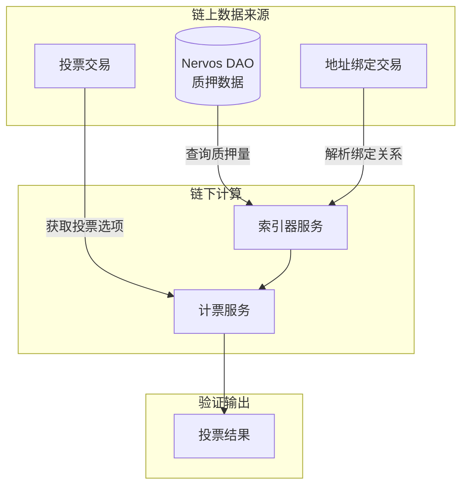

# 去中心化与可审计性

CCFDAO 1.1 是基于 Web5 技术架构的社区治理系统。本文档详细说明投票系统的去中心化设计原则、数据透明机制，以及社区成员如何独立验证投票结果，以回应关于系统中心化风险的关切。

## 系统概览

### 代码仓库

**公共基础服务**（与其他 Web5 应用共用）：

| 服务 | 仓库地址 | 说明 |
|------|---------|------|
| PDS | https://github.com/web5fans/rsky | 个人数据存储服务 |
| Web5 DID Indexer | https://github.com/web5fans/web5-indexer | DID 索引服务 |
| DID CKB 合约 | https://github.com/web5fans/did-ckb | 链上 DID 合约 |
| Relayer| https://github.com/web5fans/indigo | 中继服务 |

**CCFDAO 1.1 专属服务**：

| 服务 | 仓库地址 | 说明 |
|------|---------|------|
| App View | https://github.com/CCF-DAO1-1/app_view | 应用视图服务 |
| 前端 | https://github.com/CCF-DAO1-1/ckb-fund-dao-ui | 用户界面 |
| Address Bind Indexer | https://github.com/CCF-DAO1-1/web5-components/tree/main/address-bind/be | 地址绑定索引器 |
| Vote Indexer | https://github.com/web5fans/web5-indexer | 投票索引器（与 DID Indexer 共享代码） |
| NervosDao Indexer | https://github.com/web5fans/web5-indexer | NervosDao索引器（与 DID Indexer 共享代码） |
| 投票合约 | https://github.com/CCF-DAO1-1/ckb-dao-vote | 链上投票智能合约 |
| 文档 | https://github.com/CCF-DAO1-1/ccfdao-v1.1-docs | 本文档仓库 |

## 投票系统核心需求

投票系统的设计遵循以下核心原则：

1. **结果可独立验证**：社区成员可仅通过链上数据独立计算投票结果，确保透明可信
2. **与 Metaforo 保持一致**：计票和权重规则与原有 Metaforo 平台保持一致

### 详细需求规格

| 需求项 | 说明 |
|--------|------|
| 地址绑定 | 支持 Neuron 钱包质押用户绑定到便于投票的 CKB 地址；PW Lock 自动绑定到对应 Omni Lock 地址 |
| 改票机制 | 用户可多次投票，以最后一次投票选项为准 |
| 取消投票 | 用户可取消投票，取消后不计入最终结果 |
| 动态权重 | 投票期间用户可随时通过新增/删除地址绑定、调整质押来改变投票权重 |
| 提案发起门槛 | 权重大于 10 万的用户才可发起提案 |
| 投票资格 | 权重大于 0 的用户才可参与投票 |
| 绑定关系处理 | 一个 Neuron 地址仅能绑定一个地址；多次变更以最新为准；若被绑定地址自身参与投票，则以该地址自身投票为准，绑定关系作废 |

## 投票系统架构设计

### 核心公式

```
投票结果 = Group_Sum(用户投票选项, 用户权重)
其中：用户权重 = 投票地址权重 + 绑定地址权重 + 可能的 PW-Lock 权重
```

### 关键数据上链

为实现透明可信的目标，以下关键数据均存储在链上：



| 数据类型 | 存储位置 | 说明 |
|---------|---------|------|
| 地址权重 | CKB 链上（Nervos DAO） | 地址在 Nervos DAO 中的质押数量 |
| 地址绑定关系 | CKB 链上交易 | 通过发送交易新增/删除绑定关系 |
| 用户投票 | CKB 链上合约 | Vote Cell 存储投票选项 |

地址绑定的详细说明参见[地址绑定系统](./address-binding)文档。

## 投票合约设计权衡

投票合约被设计为通用目的，以支持后续物业团队选举等场景：

### 设计决策

| 设计项 | 通用设计 | DAO 1.1 实际使用 |
|--------|---------|-----------------|
| `smt_root_hash` | 可选字段 | **必填**，表示有投票权的用户列表的 SMT 根哈希 |
| `extra` | 可选字段 | **必填**，存储提案内容的哈希 |
| 投票选项 | 多选（按 bit 位取或） | 单选（0-弃权，1-同意，2-反对），多选视为非法 |
| 时间字段 | `start_time`/`end_time` | 固定为 0，实际时间由链下计算，起始时间为 VoteMeta 交易上链时间，结束时间为起始时间加固定时长(42/18 Epoch) |

### 合约验证逻辑

投票合约仅执行两项关键检查：

1. **成员资格验证**：通过检查 witness 中的 proof，确认投票地址是否在 SMT 投票人列表中
2. **选项合法性**：验证投票选项是否合法

其余检查（时间范围、剔除无效票等）均在链下计票服务中完成。

### 用户体验优化

为减少对投票用户的 CKB 占用：
- 投票 Cell 典型大小：118 CKB
- 用户投票后可立即销毁 Cell，回收 CKB
- 仅需支付两笔交易手续费

## 有投票权用户列表（Voter List）详解

社区关切的焦点集中在有投票权用户列表的收集和更新机制。此前代码和文档中使用"白名单"一词可能引起中心化审查的担忧，现已全部替换为更中性的"voter list"。

### Voter List 来源

原则上，有投票权的用户列表非常清晰：**在 Nervos DAO 中质押 CKB 的用户列表**，相关数据在 CKB 链上。

### 技术限制与解决方案

| 限制 | 说明 | 解决方案 |
|------|------|---------|
| 合约无法直接引用 | 投票合约无法直接在链上读取 Nervos DAO 数据 | 采用链下服务收集，组装为 SMT |
| 列表过大 | 主网有 16,407 个地址质押 CKB，直接使用会导致交易缓慢且费用高昂 | 精简为：有 DID 的质押用户 |

### 精简为 DID 用户的合理性

将 voter list 精简为"在 Nervos DAO 质押且拥有 Web5 DID 的用户"的依据：

1. **参与率数据**：以 DAO 1.1 提案投票为例，参与人数不足 500 人，相对于总质押用户比例较小
2. **技术架构一致性**：DAO 1.1 采用 Web5 技术，无 DID 的用户无法参与系统交互
3. **数据透明性**：用户是否拥有 DID 也是链上数据，未降低方案透明可信程度

### Voter List 更新机制

| 参数 | 数值 | 说明 |
|------|------|------|
| 更新周期 | 10,000 区块 | 约 1 天 |
| 更新内容 | DID + 质押数据 | 双重条件筛选 |
| 存储方式 | SMT Root Hash | 32 字节链上存储 |

## 社区验证方案

虽然整个投票过程步骤繁琐、规则复杂，但所有数据最初来源均为 CKB 链上，中间仅为机械性数据处理，无任何主观操作空间。社区成员只要从链上获取数据，按照同样的步骤和规则，一定可以得出同样的投票结果。

验证流程简述：
* 1 - 5 获取投票相关的信息。
* 6 - 10 验证 voter list。
* 11 - 15 验证计票结果。

### 详细验证流程

#### 1. 定位投票交易

找任意一个参与了投票的用户，查看其钱包交易历史，找到类似 [此交易](https://explorer.app5.org/transaction/0x53886a927baa175e08e99345e52546a7be4570081189890308e736a7f3b883b9) 的投票交易。

特征是：Type CodeHash 为 `0x38716b429cb139405d32ff86a916827862b2fa819916894848d8460da8953afb`

投票 Cell 示例：

```json
{
  "capacity": "0x2bf55b600",
  "lock": {
    "codeHash": "0x9bd7e06f3ecf4be0f2fcd2188b23f1b9fcc88e5d4b65a8637b17723bbda3cce8",
    "hashType": "type",
    "args": "0xfbd94b915f05d05f669e7f96c7290fbf26b93d96"
  },
  "type": {
    "codeHash": "0x38716b429cb139405d32ff86a916827862b2fa819916894848d8460da8953afb",
    "hashType": "type",
    "args": "0x8594d2dbaa9b72f7bed5bd17ae50f16673bb782f"
  },
  "data": "0x02000000"
}
```


#### 2. 获取 VoteMeta

解析投票交易的 `cellDeps`：

```json
[
  {
    "outPoint": {
      "txHash": "0xd8cb3f3b109ab35e51cb0c849f2b66159e376e125c6b701d193a6a636eb3247d",
      "index": "0x0"
    },
    "depType": "code"
  },
  {
    "outPoint": {
      "txHash": "0x4c67178b3b0fb2ae88a360b81f03f4f34ef06253906b38dcfdb00ac2b2cf35f4",
      "index": "0x0"
    },
    "depType": "code"
  },
  {
    "outPoint": {
      "txHash": "0x71a7ba8fc96349fea0ed3a5c47992e3b4084b031a42264a018e0072e8172e46c",
      "index": "0x0"
    },
    "depType": "depGroup"
  }
]
```

排除：
- `cellDep[0]`：Vote 合约本身
- `cellDep[2]`：secp256k1/blake160

剩余 `cellDep[1]` 即为 VoteMeta 的依赖，其中的outpoint指向 VoteMeta Cell。


#### 3. 确定投票时间范围

- **开始高度**：创建 VoteMeta 交易所在高度（示例：18,807,213）
- **Epoch 表示**：13801 463/1073
- **结束 Epoch**：开始 Epoch + 42 = 13843 463/1073
- **结束高度**：对应区块高度（示例：18,861,258  Epoch表示 13843 545/1263）

> **注意**：CKB 的 epoch 长度不固定，需要一些计算和尝试。因为epoch 13843的epoch len是1263，分数部分等比转换为 545/1263(除不尽的时候向上取整)

#### 4. 过滤投票交易

根据 type 过滤出 `[开始高度, 结束高度]` 之间的所有投票交易。

#### 5. 解析 VoteMeta

使用 Molecule 反序列化 VoteMeta Cell 的 data。

结构参见 [vote.mol](https://github.com/CCF-DAO1-1/ckb-dao-vote/blob/main/contracts/ckb-dao-vote/molecules/vote.mol#L13)

```
0x9b0000001800000038000000670000006f000000770000006cbbcea30306f401f4f8adc963d60cc8670c4603e25329bc755df0cfbc22d9972f000000100000001b00000024000000070000004162737461696e05000000416772656507000000416761696e737400043101cb0035e900043101fd0035e920000000217a69d19c517685466796fa3f9180d29f4661686ff9c3490c8c1b1f88a1e151
```

反序列化结果：

```javascript
VoteMeta {
  smt_root_hash: '0x6cbbcea30306f401f4f8adc963d60cc8670c4603e25329bc755df0cfbc22d997',
  candidates: [ 'Abstain', 'Agree', 'Against' ],
  start_time: 16804338456501224448n,
  end_time: 16804338671249589248n,
  extra: '0x217a69d19c517685466796fa3f9180d29f4661686ff9c3490c8c1b1f88a1e151'
}
```

其中 `smt_root_hash` 即本次投票的 voter list 组成的 SMT 的根哈希。

#### 6. 确定 Voter List 更新高度

Voter list 的更新高度是**投票开始高度向下取整到 10,000 的倍数**：

```
18,807,213 → 18,800,000
```

> **边界情况处理**：如果投票开始高度刚刚超过 10,000 的倍数一点点（如 18,800,002），由于上链需要时间，可能实际使用的是前一个更新高度（18,790,000）。验证时应两个高度都尝试执行步骤 7-10。

因此，本次投票的 voter list 是在 **18,800,000 高度** 时更新的。

#### 7. 获取 DID 用户列表

从 Web5 DID Indexer 接口获取：

```
https://did-indexer.bbs.fans/did-set?until_height=18800000
```

按 Voter List 更新高度查询

> 如对 indexer 数据可信程度有担忧，社区可自行运行 indexer，或参考开源代码自行实现。

#### 8. 查询地址绑定

对 DID 用户列表 中的每个地址调用 Address Bind Indexer 的 `by_to_at_height`（按 Voter List 更新高度查询）：

```bash
curl -vv http://localhost:9533/by_to_at_height/ckt1qzda0cr08m85hc8jlnfp3zer7xulejywt49kt2rr0vthywaa50xwsqwu8lmjcalepgp5k6d4j0mtxwww68v9m6qz0q8ah/18800000
```

响应示例：

```json
[{"height":18800000, "tx_index":1, "from":"ckt1qzda0cr08m85hc8jlnfp3zer7xulejywt49kt2rr0vthywaa50xwsqwu8lmjcalepgp5k6d4j0mtxwww68v9m6qz0q8ah"}]
```

形成 voter 与其绑定地址的映射表：

| DID地址 | 绑定地址 |
|--------|---------|
| A | A1, A2, A3 |
| B | B1, B2， C |
| C | (pw lock) |

#### 9. 查询质押数量

按拥有 DID 的地址列表，包含与其绑定的地址（以及pw lock），逐个在 Nervos DAO indexer 中按 Voter List 更新高度查询质押数量，并按绑定关系汇总到DID地址。

```bash
curl -vv http://localhost:9533/query_dao_stake_until_height?until_height=18800000&ckb_list=ckt1qzda0cr08m85hc8jlnfp3zer7xulejywt49kt2rr0vthywaa50xwsqwu8lmjcalepgp5k6d4j0mtxwww68v9m6qz0q8ah
```

响应示例：

```json
{
  ckt1qzda0cr08m85hc8jlnfp3zer7xulejywt49kt2rr0vthywaa50xwsqwu8lmjcalepgp5k6d4j0mtxwww68v9m6qz0q8ah: 100000
}
```

剔除质押为 0 的 DID 地址, 剩余 DID 地址列表即为 voter list。

#### 10. 验证 SMT Root Hash

获取 voter list 后：
1. 取每个地址的 lock hash
2. 以 bytes 形式升序排列
3. 组装 SMT
4. 与第 5 步中的 `smt_root_hash` 对比

#### 11. 剔除无效投票
根据第 4 步获取的所有投票：

| 顺序 | 处理规则 | 说明 |
|------|---------|------|
| 1 | 多次投票 | 仅取最后一次 |
| 2 | 多选投票 | 视为无效 |

#### 12. 查询地址绑定

有效投票中的每个地址调用 Address Bind Indexer 的 `by_to_at_height`（按投票结束高度查询）：

```bash
curl -vv http://localhost:9533/by_to_at_height/ckt1qzda0cr08m85hc8jlnfp3zer7xulejywt49kt2rr0vthywaa50xwsqwu8lmjcalepgp5k6d4j0mtxwww68v9m6qz0q8ah/18861258
```

响应示例：

```json
[{"height":18861258, "tx_index":1, "from":"ckt1qzda0cr08m85hc8jlnfp3zer7xulejywt49kt2rr0vthywaa50xwsqwu8lmjcalepgp5k6d4j0mtxwww68v9m6qz0q8ah"}]
```

形成 voter 与其绑定地址的映射表：

| 主地址 | 绑定地址 |
|--------|---------|
| A | A1, A2, A3 |
| B | B1, B2， C |
| C | - |

#### 13. 计算权重

有效投票中的每个地址，包含与其绑定的地址（以及pw lock），逐个在 Nervos DAO indexer 中按投票结束高度查询质押数量，并按绑定关系汇总到投票地址。

```bash
curl -vv http://localhost:9533/query_dao_stake_until_height?until_height=18861258&ckb_list=ckt1qzda0cr08m85hc8jlnfp3zer7xulejywt49kt2rr0vthywaa50xwsqwu8lmjcalepgp5k6d4j0mtxwww68v9m6qz0q8ah
```

响应示例：

```json
{
  ckt1qzda0cr08m85hc8jlnfp3zer7xulejywt49kt2rr0vthywaa50xwsqwu8lmjcalepgp5k6d4j0mtxwww68v9m6qz0q8ah: 100000
}
```

#### 14. 剔除无效权重

若用户自身投票同时绑定到另一地址（如示例中的 C 绑定到 B），则 B 的权重不包含 C 的权重

#### 15. 最终计票

根据有效投票的选项，和对应的权重，计算最终结果:

| 选项 | 权重 |
|-----|------|
| Agree | 200000 |
| Against | 100000 |

## 总结

CCFDAO 1.1 投票系统通过以下机制确保去中心化和可审计性：

| 维度 | 机制 | 保障 |
|------|------|------|
| 数据来源 | 全部来自 CKB 链上 | 不可篡改、公开透明 |
| 验证逻辑 | 合约仅验证成员资格和选项合法性 | 规则明确、无主观空间 |
| 计算过程 | 机械性数据处理 | 可复现、可验证 |
| 社区监督 | 完整的验证工具链 | 任何人可独立审计 |

系统的透明可信是有充分保障的。任何社区成员都可以按照本文档提供的步骤，完全独立地验证任何一次投票的结果，无需信任任何中心化服务或机构。
