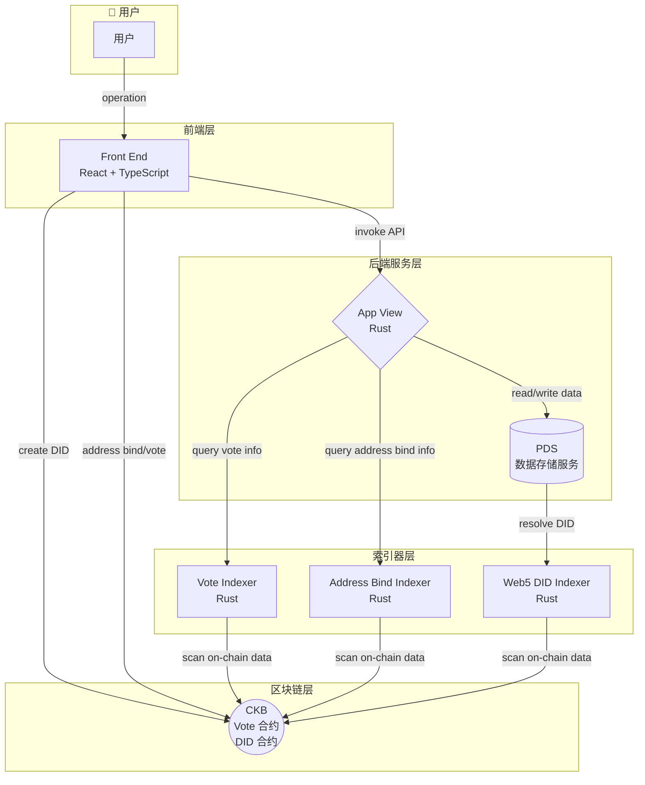

# 技术概览

DAO v1.1 使用 Web5 技术架构，结合了 Web2 的用户体验和 Web3 的去中心化优势，为用户提供自主身份管理和可验证数据的 DAO 治理平台。

## 技术架构

## 数据流说明

1. **用户操作流程**：用户通过前端界面进行操作，前端调用 App View 的 API
2. **DID 创建**：用户创建 DID 时，直接与 CKB 区块链交互
3. **地址绑定与投票**：用户进行地址绑定或投票时，交易直接提交到 CKB 区块链
4. **数据查询**：App View 通过各索引器查询链上数据，提供快速的数据访问
5. **用户数据管理**：用户的个人数据通过 App View 存储在 PDS 中

## 组件介绍

### Front End（前端）

前端用户界面，基于 React + TypeScript 构建。提供以下核心功能：

- **用户注册与登录**：支持用户创建和管理 Web5 DID 身份
- **地址绑定**：允许用户将 CKB 地址绑定到其 DID 身份
- **提案管理**：创建、查看和管理 DAO 提案
- **投票操作**：参与提案投票，支持链上投票验证

### App View（应用服务）

信息汇聚服务，使用 Rust 开发。作为系统的核心中间层，负责：

- **请求处理**：接收并处理来自前端的 API 请求
- **区块链交互**：与 CKB 区块链进行数据交互
- **数据协调**：与 PDS 数据存储服务进行读写操作
- **索引查询**：向各索引器查询链上数据状态

### PDS（Personal Data Server， 个人数据服务器）

数据存储服务，使用 Rust 开发。基于 [AT Protocol](https://atproto.com/) 实现：

- **用户数据存储**：安全存储用户的个人数据和提案相关信息
- **数据可验证性**：确保数据的完整性和可验证性
- **数据可迁移**：用户可在不同 PDS 之间迁移数据，甚至部署自己的 PDS

### Web5 DID Indexer

DID 索引器服务，使用 Rust 开发：

- **链上扫描**：持续扫描区块链上的 DID 信息
- **数据索引**：将 DID 数据结构化存储到数据库
- **查询接口**：提供高效的 DID 查询 API

### Address Bind Indexer

地址绑定索引器服务，使用 Rust 开发：

- **绑定信息扫描**：扫描区块链上的地址绑定交易
- **关系映射**：维护 DID 与 CKB 地址的绑定关系
- **查询服务**：提供地址绑定信息的查询接口

### Vote Indexer

投票索引器服务，使用 Rust 开发：

- **投票数据扫描**：扫描区块链上的投票交易
- **投票统计**：汇总和计算投票结果
- **查询接口**：提供投票信息的实时查询服务

### CKB 智能合约

部署在 CKB 区块链上的智能合约，使用 Rust 开发：

#### DID 合约

- **DID 存储**：链上存储用户的 DID 信息
- **生命周期管理**：支持 DID 的创建、转移、更新和销毁操作
- **身份验证**：提供链上身份验证能力

#### Vote 合约

- **投票存储**：链上存储用户的投票信息
- **投票项创建**：支持创建新的投票项目
- **投票人列表验证**：验证投票参与者的资格

## 技术栈

| 组件 | github | 技术栈 | 说明 |
|------|--------|--------|------|
| Front End | https://github.com/CCF-DAO1-1/ckb-fund-dao-ui | React + TypeScript | 现代化前端框架，提供良好的开发体验和类型安全 |
| App View | https://github.com/CCF-DAO1-1/app_view | Rust | 高性能后端服务，确保系统稳定性和安全性 |
| PDS | https://github.com/web5fans/rsky | Rust | 数据存储服务，基于 AT Protocol |
| Web5 DID Indexer | https://github.com/web5fans/web5-indexer/blob/master/src/db/did.rs | Rust | DID 索引服务 |
| Address Bind Indexer | https://github.com/CCF-DAO1-1/web5-components/blob/dev/address-bind/be/src/indexer.rs | Rust | 地址绑定索引服务 |
| Vote Indexer | https://github.com/web5fans/web5-indexer/blob/master/src/db/vote.rs | Rust | 投票索引服务 |
| CKB 合约(DID，Vote) | https://github.com/web5fans/did-ckb https://github.com/CCF-DAO1-1/ckb-dao-vote | Rust | CKB 区块链上的智能合约，包含 DID 合约和 Vote 合约 |

## 架构特点

### 1. 用户身份自主

- **去中心化身份**：使用基于 CKB 区块链的 [did:ckb](https://github.com/web5fans/web5-wips) 作为用户身份标识
- **钱包掌控**：用户通过自己的钱包完全掌管自己的身份
- **无需许可**：无需第三方机构授权即可创建和管理身份

### 2. 数据可验证

- **AT Protocol**：使用去中心化网络协议 [AT Protocol](https://atproto.com/)
- **防篡改**：用户数据可验证，平台无法篡改用户数据
- **数据主权**：用户可以完全掌管自己的数据，可在不同的 PDS 之间迁移，甚至使用自己部署的 PDS

### 3. 结合 Web2 和 Web3 的优点

- **Web2 体验**：提案相关的操作提供 Web2 级别的用户体验，操作流畅、响应迅速
- **Web3 安全**：投票使用链上合约，确保过程公开可验证
- **透明可信**：地址绑定信息存储在链上，确保用户投票权重公开可验证