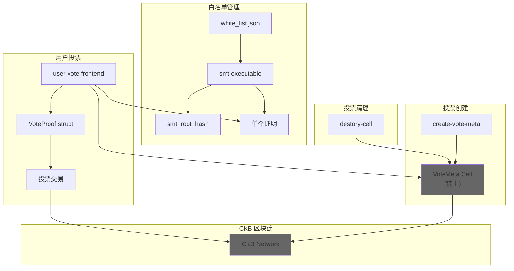
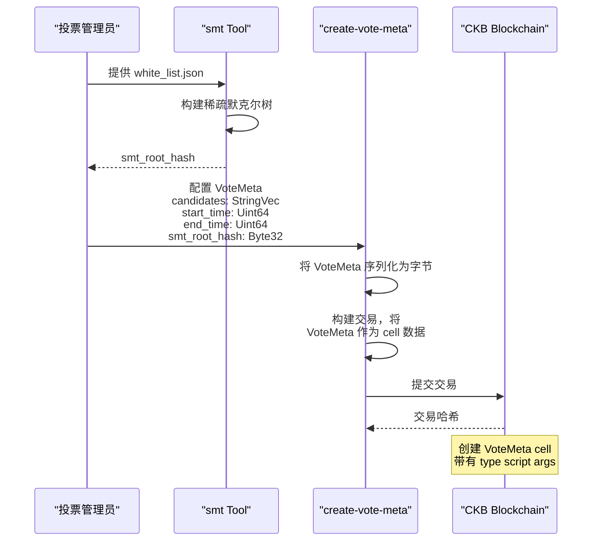
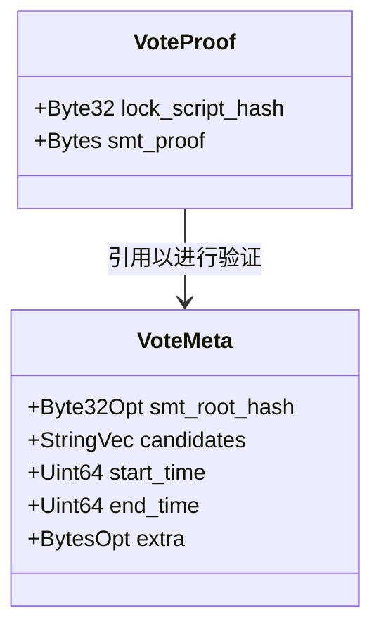
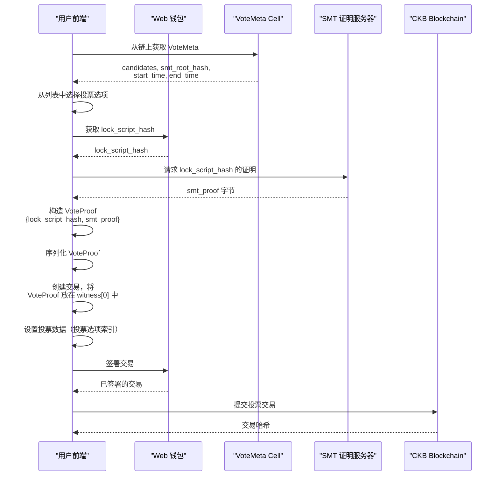
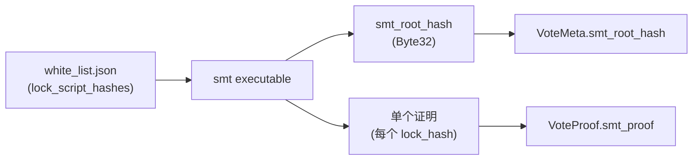
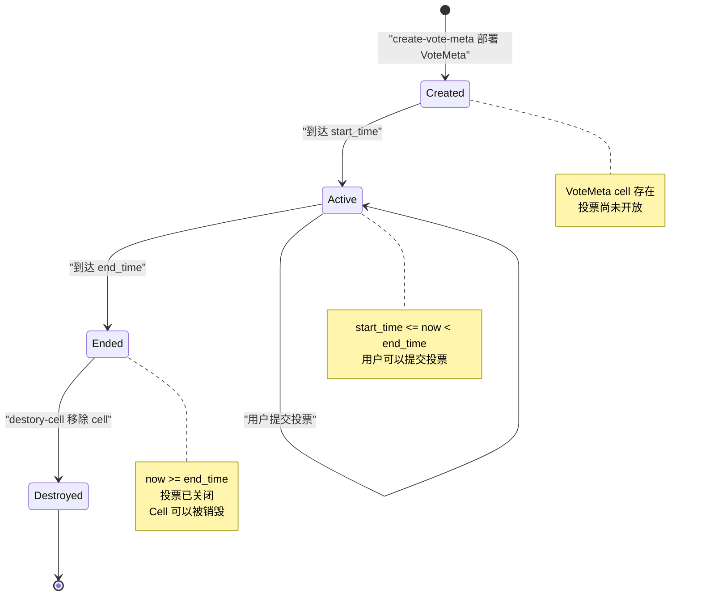

## 目的与范围
投票系统为 CKB 区块链提供了一个去中心化的链上投票机制。该系统支持创建具有多个候选项、限时投票期和使用稀疏默克尔树（SMT）进行密码学白名单验证的投票。与地址绑定系统（参见[地址绑定系统](address-binding)）不同，投票系统采用纯 web3 架构，没有中心化后端——所有数据都存储在链上并在链上验证。

本文档涵盖了投票创建流程、用户投票过程、SMT 白名单管理以及整个系统中使用的 Molecule 数据结构。关于 Molecule 序列化格式的详细信息，请参见 Molecule 序列化。

---

## 系统架构

投票系统完全在链上运行，链下组件极少，投票系统依赖 CKB 区块链 cell 来存储所有状态。

### 组件概览图



---

## 投票创建流程

投票创建涉及生成定义投票参数的 `VoteMeta` 结构，并将其作为 cell 部署到 CKB 区块链上。

### VoteMeta 结构

`VoteMeta` 结构在 Molecule schema 中定义，包含：

| 字段 | 类型 | 目的 |
|-------|------|---------|
| `smt_root_hash` | `Byte32Opt` | 投票者白名单的稀疏默克尔树根哈希 |
| `candidates` | `StringVec` | 投票选项名称的字符串向量 |
| `start_time` | `Uint64` | 投票期开始的 Unix 时间戳 |
| `end_time` | `Uint64` | 投票期结束的 Unix 时间戳 |
| `extra` | `BytesOpt` | 可选的额外元数据 |

`create-vote-meta` 组件构造此结构并将其部署到区块链。`smt_root_hash` 字段对投票者验证至关重要 - 它作为授权投票者列表的密码学承诺，而无需在链上透露所有投票者。

### 投票创建流程



示例输出显示了一个具有以下内容的 VoteMeta：
- `candidates: [ 'no', 'not bad', 'good', 'awesome' ]`
- `start_time: 2305843009213694052n`
- `end_time: 2305843009213694094n`
- `smt_root_hash: '0x7e602b84ea55d05337c674f99c279b674a454c7186f0b8fc308291783dd59245'`
- `extra: '0x7ecd3c88a1ee095f66ac5690edc9b67feec822bc118c22c7ff67c99513ac107e'`

生成的投票 cell 具有带有 `args: '0x456c88d8a9569d4881df935e4674a2fc96148917'` 的 type script。


---

## 投票

用户通过构造包含 `VoteProof` 结构的交易来投票，该结构在 witness 中证明其通过 SMT 成员资格证明的资格。

### VoteProof 结构



`VoteProof` 结构包含：
- `lock_script_hash`：投票者锁脚本的哈希（标识投票者）
- `smt_proof`：证明此 lock_script_hash 在授权投票者白名单中的密码学证明

### 投票流程



### 示例投票交易

user-vote 前端演示了完整的投票流程。示例输出显示：

```
vote data:  0x04000000
vote proof:  0x540000000c0000002c000000abbfbf9155679b5d1399b4aa04dac6f3f71e63fd3ae4759110a415169eefeeed240000004c4fff50378f5d8873eed84dbfd327bd9b258f2e0a262364b6fd5cb0550e799dba067da4
```

交易 witness 包含：
- 位置 0：签名和 VoteProof 结构
- VoteProof 经过十六进制编码，包括 lock_script_hash 和 smt_proof

交易结构包括：
- 输入 cell：用户的容量 cell，用于支付费用
- 输出 cell：带有引用 VoteMeta 的 type script 的投票 cell
- Witness：`[0]` 包含签名，`[1]` 包含 VoteProof
- 输出数据：所选投票选项（编码为字节）


### 设置与执行

user-vote 组件是一个 TypeScript 前端应用程序：

```bash
npm install
npm start
```

依赖项包括：
- `@ckb-ccc/ccc`：CKB 钱包集成库
- `@ckb-ccc/core`：CKB 核心功能
- `ts-node`：TypeScript 执行
- `typescript`：TypeScript 编译器

---

## SMT 白名单工具

稀疏默克尔树（SMT）工具处理投票者白名单并生成用于高效链上验证的密码学证明。

### SMT 架构




### 白名单处理

`smt` 命令行工具：

1. **输入**：读取包含授权锁脚本哈希数组的 `white_list.json`
2. **处理**：从锁哈希构造稀疏默克尔树
3. **输出**： 
   - 单个 `smt_root_hash`（32 字节）- 嵌入到 VoteMeta 中
   - 每个 lock_hash 的单个证明 - 提供给投票者

### 证明生成

对于白名单中的每个授权投票者，SMT 工具生成唯一的成员资格证明。此证明允许链上验证给定的 lock_script_hash 在授权集合中，而无需透露整个白名单。

证明是紧凑的（可变长度字节），可以通过以下方式在链上高效验证：
1. 获取投票者的 `lock_script_hash`
2. 获取 `smt_proof` 字节
3. 重新计算树根
4. 与 `VoteMeta.smt_root_hash` 进行比较

---

## 投票数据模型

投票系统使用 Molecule schema 进行数据结构的确定性序列化。

### Molecule Schema 定义

完整的 schema 定义在 [vote/molecules/vote.mol:1-21]() 中：

```
array Uint64 [byte; 8];

vector Bytes <byte>;
option BytesOpt (Bytes);

vector String <byte>;
option StringOpt (String);
vector StringVec <String>;

table VoteMeta {
    smt_root_hash: Byte32Opt,
    candidates: StringVec,
    start_time: Uint64,
    end_time: Uint64,
    extra: BytesOpt,
}

table VoteProof {
    lock_script_hash: Byte32,
    smt_proof: Bytes,
}
```

### 类型定义

| 类型 | 定义 | 用途 |
|------|------------|-------|
| `Uint64` | 固定 8 字节数组 | 时间戳（start_time、end_time） |
| `Bytes` | 可变长度字节向量 | 通用字节数据 |
| `BytesOpt` | 可选的 Bytes | 额外元数据、可选字段 |
| `String` | 表示字符串的字节向量 | 单个投票选项名称 |
| `StringVec` | String 的向量 | 投票选项列表 |
| `Byte32` | 32 字节数组（继承） | 锁脚本哈希、SMT 根 |
| `Byte32Opt` | 可选的 Byte32 | SMT 根哈希 |

### VoteMeta 表结构

`VoteMeta` 表使用 Molecule 的表编码，提供：
- 字段存在性验证
- 确定性序列化
- 高效解析

字段按顺序序列化：
1. `smt_root_hash`（可选 32 字节）
2. `candidates`（可变长度字符串向量）
3. `start_time`（8 字节）
4. `end_time`（8 字节）  
5. `extra`（可选可变长度字节）

### VoteProof 表结构

`VoteProof` 表更简单：
1. `lock_script_hash`（必需 32 字节）- 投票者身份
2. `smt_proof`（可变长度字节）- 默克尔证明

示例序列化的 VoteProof：
```
0x540000000c0000002c000000abbfbf9155679b5d1399b4aa04dac6f3f71e63fd3ae4759110a415169eefeeed240000004c4fff50378f5d8873eed84dbfd327bd9b258f2e0a262364b6fd5cb0550e799dba067da4
```

分解：
- 总长度：`0x54000000`（84 字节）
- 第一个字段偏移：`0x0c000000`（12 字节头）
- 第二个字段偏移：`0x2c000000`（44 字节）
- lock_script_hash：从偏移 12 开始的 32 字节
- smt_proof：从偏移 44 开始的剩余字节

### TypeScript 中的序列化

user-vote 前端使用 `@ckb-ccc/core` 库，该库为 TypeScript 提供 Molecule 编解码器实现。该库处理：
- 将结构编码为字节
- 将字节解码为 JavaScript 对象
- 类型验证
- 确定性序列化

---

## 投票 Cell 管理

投票 cell 具有明确的生命周期，必须在投票期结束后进行清理。

### 投票 Cell 生命周期



### Cell 销毁流程

`destory-cell` 实用程序处理过期投票 cell 的清理：

1. **验证**：检查 `current_time >= VoteMeta.end_time`
2. **交易构造**：创建消耗 VoteMeta cell 的交易
3. **容量恢复**：将 cell 容量返还给管理员
4. **提交**：向 CKB 网络广播销毁交易

此清理是必要的，因为：
- 投票 cell 占用区块链空间
- Cell 容量在投票期间被锁定
- 已完成的投票不再需要链上存储
- 容量可以被恢复和重用

### 时间约束

投票期通过比较以下内容严格执行：
- `VoteMeta.start_time`：投票开放时的 Unix 时间戳（Uint64）
- `VoteMeta.end_time`：投票关闭时的 Unix 时间戳（Uint64）
- 当前区块时间戳

有效的投票交易必须满足：
```
start_time <= block_timestamp < end_time
```

### Type Script 标识

投票 cell 由其 type script 标识。在示例中：
```
vote type args: 0x456c88d8a9569d4881df935e4674a2fc96148917
```

此 type script args 唯一标识投票会话。所有投票交易引用此 type script 以：
- 定位 VoteMeta cell
- 验证投票提交
- 完成后销毁 cell

---

## 系统集成

### 与地址绑定系统的比较

| 方面 | 投票系统 | 地址绑定系统 |
|--------|-------------|---------------------|
| **状态存储** | 完全链上（CKB cell） | 混合（链上 + PostgreSQL） |
| **后端服务** | 无 | 索引器服务 |
| **数据验证** | SMT 证明 | 签名验证 |
| **前端** | user-vote | address-bind/fe |
| **用例** | 临时投票会话 | 永久地址绑定 |

### 关键特性

投票系统的特点是：

1. **无状态操作**：不需要后端索引器
2. **链上验证**：所有验证通过智能合约
3. **隐私保护**：SMT 允许白名单验证而不透露完整列表
4. **时间限制**：明确的开始和结束时间
5. **不可变记录**：投票永久记录在区块链上

这种架构与地址绑定系统维护链下索引以提高查询效率的方法形成对比。