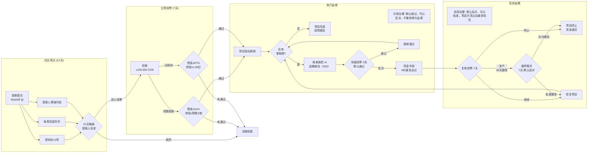

## 治理流程概览

为实现 DAO v1.1 的目标，我们提议一套全新的治理规则与流程。它在 v1.0 的基础上，整合了 DAO 物业的角色，并对从提案审议到执行监督的全过程进行了优化。所有流程均在全新的 Web5 治理平台上完成。

---

## 治理范围

与 DAO v1.0 相同，治理两类事务：

- 对生态建设项目的预算申请进行决策。
- 对 DAO 的治理元规则进行修改决策。

---

## 通用规则

- **禁止代理提案：** 所有提案必须由项目负责人以其 `did:ckb` 身份提交。
- **禁止激励投票：** 禁止任何形式的空投或资产激励来换取投票。

---

**参考来源**：[[DIS] Community Fund DAO v1.1 Web5 优化提案/ Community Fund DAO v1.1 Web5 Optimization Proposal](https://talk.nervos.org/t/dis-community-fund-dao-v1-1-web5-community-fund-dao-v1-1-web5-optimization-proposal/8973/1)
