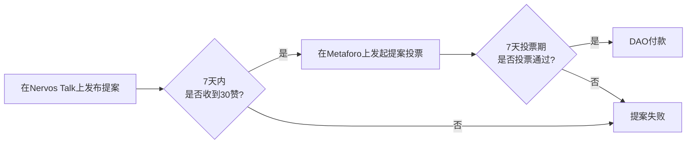

## DAO v1.0 的成功与挑战

CKB Community Fund DAO（以下简称 DAO）v1.0 作为一次成功的社区治理实验，为我们积累了宝贵的经验。然而，随着生态的发展，其极简的规则、分散的治理工具/平台在实践中也暴露出在**运营效率、项目监督和社区参与体验**上的挑战。

---

## DAO v1.0 治理流程回顾

现有 DAO v1.0 的治理流程高度依赖社区成员的自发行为：

---

## v1.0 的五大结构性挑战

通过梳理这一流程并与前运营贡献者沟通，我们发现 DAO v1.0 在程序性层面存在五大结构性挑战：

### 1. 运营过程的制度缺失

DAO 的金库由一个 2/3 多签（Jan, Terry, Cipher）的金库委员会管理，但谁来监督项目进展、谁来核查里程碑交付物、由谁来正式通知多签人付款、如何披露金库使用情况等，这些关键的运营角色和流程存在模糊性。

过去，部分职责（如检查 Nervos Talk 上提案是否获得 30 个点赞、核查非技术性里程碑、通知多签人打款）由社区成员以非正式、自发的形式承担，但这并非制度性安排。这种依赖个人而非机制的模式存在脆弱性和不可持续性。

### 2. 监督角色的错位瓶颈

DAO v1.0 流程中，DAO 在投票通过、批准初始预算后，便完全缺席了后续的里程碑监督决策环节。里程碑的核查工作由单一成员非正式承担，难以对技术、市场、设计等多元化的项目交付物做出全面的事实核查与披露。

这导致了两个问题：
- 监督可能流于形式
- DAO 作为最终决策者，缺位了对项目执行过程的持续监督

### 3. 治理工具的割裂门槛

目前的治理流程横跨多个平台：在 Nervos Talk 进行提案、讨论，再到 Metaforo 进行正式投票。这种割裂的体验不仅增加了社区成员的参与成本和认知负荷，也导致了信息的分散和上下文的丢失，是治理参与度不高的重要原因之一。

### 4. 信息传播的渠道缺乏

提案在社区讨论和投票过程中，其传播依赖项目方或部分社区积极成员的个人转发，缺乏官方、中立的信息触达渠道。这导致了信息不对称，核心讨论无法即时触达尽可能多的社区成员，影响了决策的广度和深度。

同理，在项目结项后，信息传播渠道同样缺乏，制约了社区内外对生态最新进展的了解和参与。

### 5. 关键流程的空白断层

项目缺乏正式的结项报告和流程，导致过程无法沉淀，经验无法复用，DAO 无法从过去的资助中学习和成长。这种流程断层使得每个新项目都需要重新摸索，无法建立起系统性的项目管理和知识积累机制。

---

## 核心困境

这些问题共同指向一个核心困境：

> **DAO v1.0 拥有民主的决策机制，但严重缺乏专业、持续的程序性服务来支撑这些决策的有效落地。**

---

## DAO v1.1 的解决方案

DAO v1.1 旨在解决这一困境：在保留 v1.0 核心民主精神（如投票权重基于 Nervos DAO 存款）的基础上，通过引入两大核心组件，对 DAO 的**运营规则和配套设施**进行一次升级。

### 1. DAO 物业 (DAO Stewards)

一个为 DAO 服务的专业运营团队，并配套清晰的金库管理和治理流程。

### 2. 基于 Web5 的治理平台

一个全新的治理平台，以取代当前割裂的工具，提升整体治理体验。
