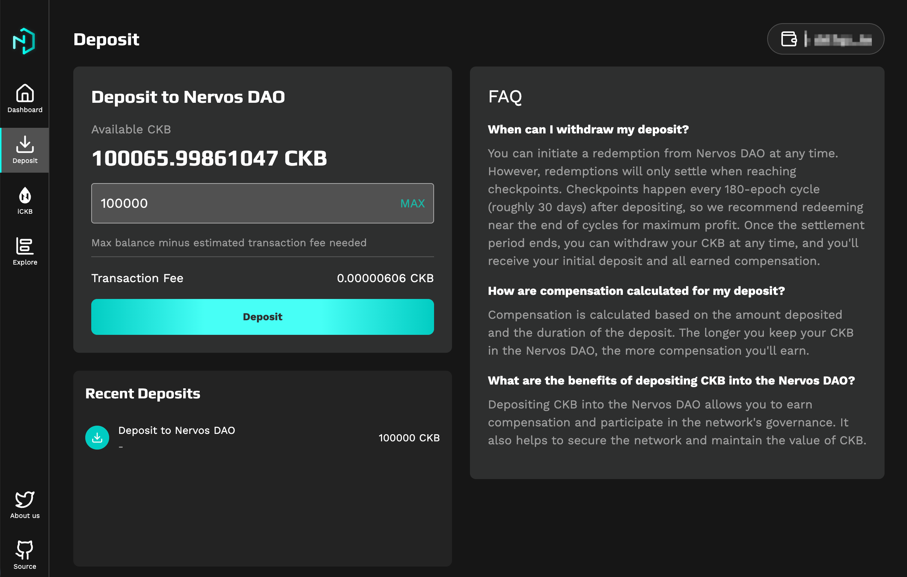
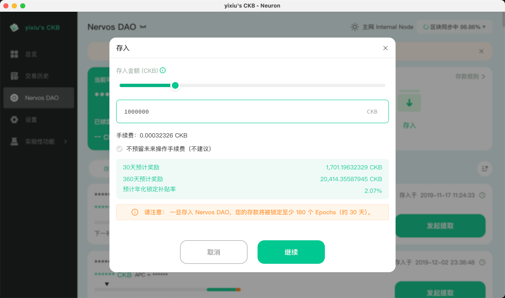

## 为什么要存入 Nervos DAO？

将 CKB 存入 Nervos DAO 是参与 CKB Community Fund DAO 治理投票的前提条件。只有在 Nervos DAO 中有锁定状态的 CKB，才能获得相应的投票权重。

<Callout title="什么是 Nervos DAO？" type="info">
Nervos DAO 是 CKB 链上的一个智能合约，允许用户锁定 CKB 以获得利息补偿（抵消二级发行带来的稀释）。存入 Nervos DAO 的 CKB 需要经过一个锁定周期才能提取。
</Callout>

## 存入渠道

目前推荐以下两种方式存入 Nervos DAO：

| 渠道 | 适合人群 | 特点 |
|------|---------|------|
| [NervDAO](https://nervdao.com) | 新手用户 | 无需同步节点，门槛低，浏览器直接操作 |
| [Neuron 钱包](https://github.com/nervosnetwork/neuron/releases) | 进阶用户 | 桌面钱包，需同步全节点，安全性更高 |

---

## 方式一：通过 NervDAO 网站存入（推荐新手）

[NervDAO](https://nervdao.com) 是一个轻量级的 Web 应用，无需下载任何软件或同步节点，直接在浏览器中即可完成存入操作。

<Steps>

<Step>

### 连接钱包

访问 [nervdao.com](https://nervdao.com)，点击「Connect Wallet」连接你的钱包。支持 JoyID、MetaMask 等多种钱包。

</Step>

<Step>

### 存入 CKB

连接钱包后，切换到 Deposit 页签，在页面上输入你想要存入的 CKB 数量，点击「Deposit」按钮。

<Callout title="最低存入金额" type="warning">
存入 Nervos DAO 需要至少 102 CKB（用于支付链上存储空间）。
</Callout>

</Step>

<Step>

### 确认交易

在钱包中确认交易，等待交易上链。交易确认后，你的 CKB 就已成功存入 Nervos DAO。

</Step>

</Steps>

---

## 方式二：通过 Neuron 钱包存入

[Neuron](https://github.com/nervosnetwork/neuron/releases) 是 Nervos 官方的桌面钱包，提供完整的节点功能和更高的安全性。

<Callout title="注意" type="warning">
Neuron 钱包需要同步 CKB 全节点数据，首次同步可能需要数小时甚至更长时间，请确保有足够的磁盘空间和网络带宽。
</Callout>

<Steps>

<Step>

### 下载并安装 Neuron

前往 [Neuron Releases](https://github.com/nervosnetwork/neuron/releases) 页面，下载适合你操作系统的版本并安装。

</Step>

<Step>

### 创建或导入钱包

首次使用需要创建新钱包或导入已有钱包。请妥善保管你的助记词。

</Step>

<Step>

### 等待节点同步

Neuron 会自动开始同步 CKB 节点数据。你可以在界面底部查看同步进度。

</Step>

<Step>

### 存入 Nervos DAO

节点同步完成后，进入「Nervos DAO」标签页，点击「存入」按钮，输入存入金额并确认交易。

</Step>

</Steps>

---

## 存入后的注意事项

### 锁定周期

存入 Nervos DAO 的 CKB 有一个锁定周期（约 30 天）。在锁定期内，你的 CKB 无法提取，但可以正常参与 DAO 投票。

### 提取流程

提取 Nervos DAO 中的 CKB 需要两步操作：
1. **发起提取请求** - 开始解锁流程
2. **完成提取** - 等待锁定周期结束后，完成最终提取

### 投票权重

你的投票权重等于你在 Nervos DAO 中**处于锁定状态**的 CKB 总量。已发起提取但尚未完成的 CKB 不计入投票权重。

---

## 下一步

存入 Nervos DAO 后，你可以：

- [注册 Web5 DID](./register-web5-did) 领取你的 Web5 DID，参与 DAO 治理投票。