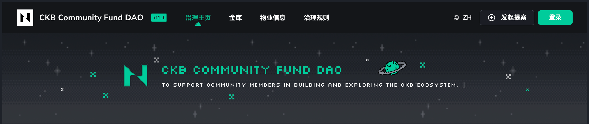
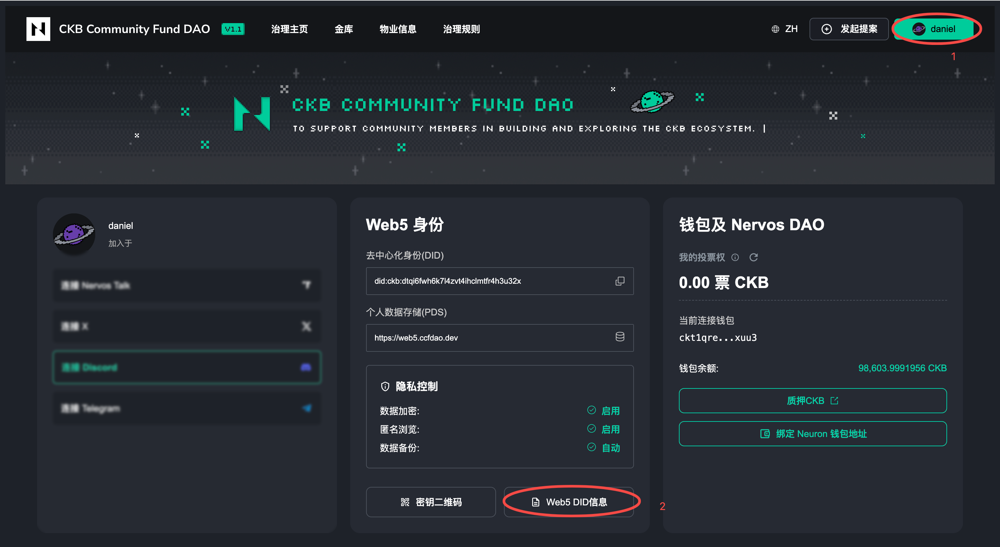

import step2 from './images/register-web5-did/step2.png';
import step3 from './images/register-web5-did/step3.png';
import step4 from './images/register-web5-did/step4.png';
import step5 from './images/register-web5-did/step5.png';
import step6 from './images/register-web5-did/step6.png';
import step7 from './images/register-web5-did/step7.png';
import step9 from './images/register-web5-did/step9.png';
import step10 from './images/register-web5-did/step10.png';
import step11 from './images/register-web5-did/step11.png';

## 前置条件

在开始注册之前，请确保您已完成以下准备：

- 已安装并配置好 CKB 钱包（如 JoyID 或其他兼容钱包）
- 钱包中至少有 450 CKB，用于 Web5 DID 上链时的存储占用，当您不再需要 Web5 DID 时，可以销毁它，相应的 CKB 也会退还到您的钱包中。

## 注册步骤

### 第一步：访问 CCF DAO 并登录

访问 CCF DAO 官网🔗：https://ccfdao.dev ，点击页面右上角的 **登录** 按钮。
<Callout title="注意" type="warning">
ccfdao.dev 仅作为公测期间使用，待公测结束后，DAO1.1 治理平台官网会启用正式的域名。
</Callout>

### 第二步：选择创建方式

在弹出的「创建账号」对话框中，您可以看到创建 Web5 DID 账号的好处说明。

点击 **连接钱包创建** 按钮开始创建流程。如果您已有 Web5 DID，可以点击「已有 Web5 DID」进行导入。

  

### 第三步：连接钱包

系统会调起您的钱包进行连接授权。授权成功后，页面会显示「钱包已连接」状态及您的钱包地址。

确认钱包连接成功后，点击 **下一步** 继续。

  

### 第四步：设置账号名称

进入「设置名称」步骤，在输入框中设置您的 Web5 DID 账号名称。

名称支持由数字、字母或特殊字符 `-` 组成。这个名称将成为您的专属域名前缀（如输入 `daniel`，则域名为 `daniel.web5.ccfdao.dev`）。

设置完成后点击 **下一步**。

  

### 第五步：完成上链存储

进入「上链存储」步骤，您需要将左侧的星球图标拖拽到右侧的 Nervos 星系中，以完成链上存储操作。

授权后，您的 Web5 账号数据将永久存储在区块链上，无法被第三方篡改。

  

### 第六步：等待上链确认

拖拽完成后，系统会生成 CKB 链上交易，您需要在钱包中进行签名确认，之后等待链上交易确认。

等待上链这个过程可能需要10秒 - 30秒左右的时间，这期间请耐心等待，**不要刷新页面**。

  

### 第七步：创建成功

当看到「账号创建成功！」提示时，说明您的 Web5 DID 账号已成功创建并存储在链上。

页面会显示您的账号信息，包括：
- 账号头像
- 账号名称
- 专属域名（如 `daniel.web5.ccfdao.dev`）
- 关联的钱包地址

点击 **进入社区** ，开始您的 DAO 之旅！

  

## 查看和管理您的 Web5 身份

### 访问个人中心

登录后，点击页面右上角的用户名即可进入个人中心页面。

在这里您可以查看：
- **Web5 Identity**：您的去中心化身份（DID）和个人数据存储（PDS）地址
- **隐私控制**：数据加密、匿名浏览、数据备份等设置状态
- **钱包与 Nervos DAO**：投票权、钱包余额等信息

### 导出 Web5 DID 信息

为了账号安全和跨设备使用，建议您导出并妥善保存 Web5 DID 信息。

1. 在个人中心页面，点击 **Web5 DID 信息** 按钮

2. 系统会要求您设置一个 8 位密码（由数字或字母组成），用于保护导出的文件

  

3. 输入密码后点击 **确认**

  

4. 点击 **导出文件** 下载包含 Web5 DID 和登录密钥的文件

  

> ⚠️ **重要提示**：请妥善保管导出的文件和密码。如果密钥泄露，您的账号将面临被盗风险！导出的文件可用于在其他设备登录或迁移到其他支持 Web5 技术的网站。

## 下一步

完成 Web5 DID 注册后，您可以：

- [绑定 Neuron 钱包地址](../getting-started/bind-nervosdao-address)

